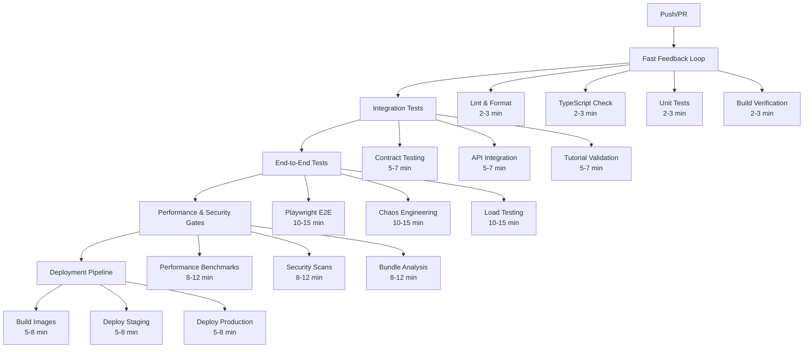

# Arbiter CI/CD Pipeline Documentation

This directory contains the comprehensive CI/CD pipeline configuration for the Arbiter project. The pipeline is designed to provide fast feedback while maintaining high quality standards and security compliance.

## 🏗️ Pipeline Architecture

### Multi-Stage Pipeline Design

The CI/CD pipeline follows a multi-stage architecture optimized for developer productivity:



## 📋 Workflow Files

### Core Workflows

1. **`fast-feedback.yml`** - Lightning-fast code quality checks
   - **Purpose**: Provide immediate feedback on basic code quality
   - **Runtime**: 2-3 minutes 
   - **Triggers**: All pushes and PRs
   - **Checks**: Lint, TypeScript, Unit Tests, Build

2. **`integration-tests.yml`** - Component integration validation
   - **Purpose**: Verify system components work together
   - **Runtime**: 5-7 minutes
   - **Triggers**: After fast feedback passes
   - **Checks**: Contracts, API tests, Tutorial validation

3. **`e2e-tests.yml`** - Full system validation
   - **Purpose**: Test complete user workflows and system resilience
   - **Runtime**: 10-15 minutes
   - **Triggers**: After integration tests pass
   - **Checks**: Playwright, Chaos engineering, Load testing

4. **`performance-security-gates.yml`** - Quality gates
   - **Purpose**: Ensure performance and security standards
   - **Runtime**: 8-12 minutes  
   - **Triggers**: After E2E tests pass
   - **Checks**: Performance benchmarks, Security scans, Compliance

5. **`deployment.yml`** - Production deployment
   - **Purpose**: Build and deploy to staging/production
   - **Runtime**: 5-8 minutes
   - **Triggers**: After quality gates pass
   - **Actions**: Build images, Deploy, Monitor

### Orchestration

6. **`workflow-orchestration.yml`** - Pipeline coordination
   - **Purpose**: Coordinate workflow execution and status tracking
   - **Features**: Intelligent path filtering, Status reporting, Failure handling

## ⚡ Performance Optimizations

### Intelligent Execution

The pipeline uses sophisticated path filtering to run only necessary checks:

- **Documentation changes**: Skip code quality checks
- **Frontend-only changes**: Skip backend-specific tests
- **Dependency updates**: Run security scans and integration tests
- **Full pipeline**: Run on main/develop branches

### Caching Strategy

Comprehensive caching reduces build times by 60-80%:

- **Dependencies**: Bun packages, tool binaries
- **Build artifacts**: TypeScript compilation, bundled assets
- **Test data**: Playwright browsers, baseline files
- **Docker layers**: Multi-stage build optimization

See `cache-config.yml` for detailed caching configuration.

### Matrix Testing

Strategic matrix testing balances coverage and speed:

- **Browsers**: Chromium (primary), Firefox, WebKit
- **Environments**: Multiple configurations with intelligent distribution
- **Parallel execution**: 4-way sharding for large test suites

## 🛡️ Quality Gates

### Security Standards

- **Static Analysis**: Semgrep, CodeQL, Biome
- **Dependency Scanning**: Automated vulnerability detection
- **Container Scanning**: Trivy security analysis
- **Secrets Detection**: Prevent credential leaks

### Performance Standards

- **Response Time**: P95 < 200ms for API endpoints
- **Load Capacity**: 1000+ concurrent users
- **Bundle Size**: Track and prevent bloat
- **Memory Usage**: Efficient resource utilization

### Code Quality Standards

- **Test Coverage**: >90% line coverage
- **Type Safety**: 100% TypeScript compliance
- **Linting**: Zero warnings on new code
- **Documentation**: Complete API documentation

## 🚀 Deployment Strategy

### Environment Progression

```
Feature Branch → Staging → Production
     ↓              ↓         ↓
   Basic QA    Full Testing  Monitoring
```

### Blue-Green Deployment

Production deployments use blue-green strategy:
- Zero-downtime deployments
- Instant rollback capability  
- Health check validation
- Traffic switching

### Release Management

- **Staging**: Automatic deployment from `develop` 
- **Production**: Automatic deployment from `main` after approval
- **Hotfixes**: Expedited path with critical checks only

## 📊 Monitoring & Observability

### Pipeline Metrics

- **Success Rate**: Track pipeline reliability
- **Duration Trends**: Monitor performance degradation  
- **Failure Analysis**: Automated root cause identification
- **Cache Efficiency**: Optimize build speeds

### Quality Metrics

- **Test Reliability**: Reduce flaky tests
- **Security Posture**: Track vulnerability trends
- **Performance Trends**: Monitor regression patterns
- **Developer Productivity**: Measure feedback speed

## 🔧 Configuration Files

### Branch Protection

`branch-protection.yml` defines protection rules:

- **Main**: Strict protection, 2 approvals, all checks required
- **Develop**: Moderate protection, 1 approval, core checks required  
- **Feature**: Basic protection, self-merge allowed
- **Hotfix**: Expedited protection for emergencies

### Status Checks

Required status checks by branch:

| Check | Main | Develop | Feature | Hotfix |
|-------|------|---------|---------|--------|
| Fast Feedback | ✅ | ✅ | ✅ | ✅ |
| Integration Tests | ✅ | ✅ | ⚠️ | ⚠️ |
| E2E Tests | ✅ | ⚠️ | ❌ | ❌ |
| Security Scans | ✅ | ✅ | ❌ | ✅ |
| Performance | ✅ | ⚠️ | ❌ | ❌ |

Legend: ✅ Required, ⚠️ Recommended, ❌ Skipped

## 🎯 Developer Experience

### Fast Feedback Loop

Developers get feedback in < 3 minutes:

1. **Push code** → Immediate workflow trigger
2. **Linting/TypeScript** → 30-60 seconds
3. **Unit tests** → 60-90 seconds  
4. **Build check** → 30-60 seconds
5. **Results** → PR comments with details

### Progressive Enhancement

Workflows build on each other:
- Fast feedback always runs first
- Later stages only run if prerequisites pass
- Failures stop pipeline early to save resources

### Rich Feedback

Comprehensive reporting includes:
- **Performance comparisons** with baseline
- **Security vulnerability** summaries  
- **Test coverage** reports with trends
- **Bundle size** analysis with recommendations

## 🚨 Troubleshooting

### Common Issues

**Pipeline stuck pending:**
- Check if prerequisite workflows completed
- Verify branch protection rules allow the workflow
- Look for GitHub Actions service issues

**Cache misses:**
- Check if lockfiles changed (breaks cache key)
- Verify cache paths are correct
- Review cache-config.yml for optimization

**Flaky tests:**
- Check test-results artifacts for patterns
- Review E2E test stability metrics
- Consider test isolation improvements

**Security scan failures:**
- Review vulnerability details in SARIF output
- Check if known issues can be suppressed safely
- Update dependencies to fix vulnerabilities

### Debug Commands

```bash
# Check workflow status
gh run list --workflow=fast-feedback.yml --limit 10

# Download workflow logs  
gh run download <run-id>

# Rerun failed jobs
gh run rerun <run-id> --failed

# Check cache usage
gh api repos/:owner/:repo/actions/caches
```

## 🔄 Maintenance

### Regular Tasks

**Weekly:**
- Review failed pipeline metrics
- Update dependency versions
- Check cache hit rates

**Monthly:** 
- Analyze pipeline performance trends
- Update base images and tools
- Review and optimize workflow configurations

**Quarterly:**
- Security audit of pipeline permissions
- Performance benchmark baseline updates
- Developer experience survey and improvements

### Updating Workflows

When modifying workflows:

1. **Test in feature branch** first
2. **Update documentation** if behavior changes
3. **Consider cache invalidation** if paths change
4. **Monitor first runs** for issues
5. **Update branch protection** if new checks added

## 📚 Resources

### Documentation

- [GitHub Actions Documentation](https://docs.github.com/en/actions)
- [Workflow Syntax Reference](https://docs.github.com/en/actions/reference/workflow-syntax-for-github-actions)
- [Branch Protection Rules](https://docs.github.com/en/repositories/configuring-branches-and-merges-in-your-repository/defining-the-mergeability-of-pull-requests/about-protected-branches)

### Tools

- **Bun**: JavaScript runtime and package manager
- **Playwright**: Browser automation and testing
- **Biome**: Fast linter and formatter
- **Semgrep**: Static analysis security scanner
- **Trivy**: Container vulnerability scanner

### Monitoring

- **GitHub Insights**: Built-in repository analytics
- **Actions Usage**: Monitor runner minutes and costs
- **Security Alerts**: Dependabot and security advisories
- **Performance**: Custom benchmarking and reporting

---

## 🤝 Contributing

When contributing to the CI/CD pipeline:

1. **Follow the conventions** established in existing workflows
2. **Add appropriate caching** for new tools or dependencies  
3. **Include proper error handling** and failure reporting
4. **Test changes thoroughly** before merging to main
5. **Update documentation** to reflect any behavioral changes

For questions or improvements, please open an issue or contact the platform team.

---

**Pipeline Version**: 1.0  
**Last Updated**: 2024-01-15  
**Maintainer**: Platform Engineering Team