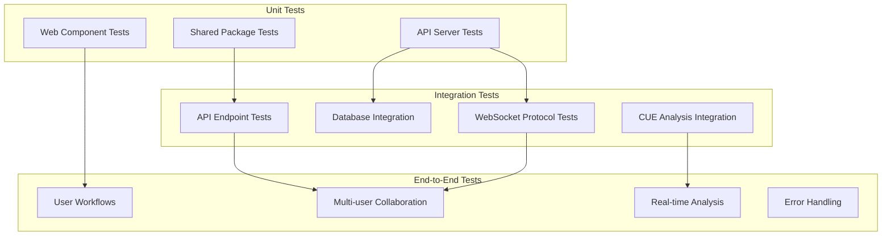

# Testing Guide

This document provides comprehensive documentation for testing the Arbiter system, including unit tests, integration tests, and end-to-end testing strategies.

## Testing Philosophy

Arbiter follows a comprehensive testing strategy that ensures reliability, performance, and security across all components:

- **Test-Driven Development** - Tests are written alongside or before implementation
- **Multiple Test Levels** - Unit, integration, and end-to-end testing
- **Real-world Scenarios** - Tests reflect actual usage patterns
- **Performance Testing** - Validate response times and resource usage
- **Security Testing** - Verify input validation and security boundaries
- **Collaboration Testing** - Multi-user scenarios and real-time features

## Test Architecture Overview



## Running Tests

### Quick Test Commands

```bash
# Run all tests across the entire project
bun run test

# Run tests for specific packages
bun run --cwd packages/shared test
bun run --cwd apps/api test  
bun run --cwd apps/web test

# Run end-to-end tests
bun run e2e

# Run tests with coverage
bun run test --coverage

# Run tests in watch mode (development)
bun run --cwd apps/api test --watch
```

### Individual Package Testing

**Shared Package:**
```bash
cd packages/shared
bun test                    # Run all tests
bun test --watch           # Watch mode
bun test --coverage        # Coverage report
```

**API Server:**
```bash
cd apps/api
bun test                    # Run all tests
bun test cue-analysis      # Run specific test file
bun test --watch           # Watch mode
bun test --coverage        # Coverage report
```

**Web Frontend:**
```bash
cd apps/web
bun test                    # Run all tests
bun test --ui              # Run with Vitest UI
bun test --coverage        # Coverage report
vitest                     # Alternative test runner
```

**End-to-End:**
```bash
# Prerequisites: Both API and Web servers running
bun run dev                # In one terminal

# Run E2E tests
bun run e2e                # All E2E tests
bun run e2e --headed       # With browser UI
bun run e2e --debug        # Debug mode
bun x playwright test      # Direct Playwright command
```

## Test Coverage Goals

| Package | Unit Tests | Integration Tests | E2E Coverage | Current Status |
|---------|------------|-------------------|--------------|----------------|
| **shared** | 95% | N/A | N/A | ✅ 90%+ |
| **api** | 90% | 90% | Critical paths | ✅ 85%+ |
| **web** | 85% | 80% | All user flows | ✅ 80%+ |
| **Overall** | 90% | 85% | Critical paths | ✅ 172 tests passing |

## Unit Testing

### Shared Package Tests

**Location:** `packages/shared/src/index.test.ts`

**Coverage:**
- Zod schema validation
- TypeScript type compatibility
- Protocol message validation
- Error handling scenarios

**Example Test:**
```typescript
import { describe, expect, it } from 'bun:test';
import { createProjectSchema, wsMessageSchema } from './schemas.js';

describe('createProjectSchema', () => {
  it('validates correct project data', () => {
    const valid = { name: 'Test Project' };
    expect(createProjectSchema.parse(valid)).toEqual(valid);
  });

  it('rejects invalid project data', () => {
    const invalid = { name: '' }; // Empty name not allowed
    expect(() => createProjectSchema.parse(invalid)).toThrow();
  });

  it('rejects oversized names', () => {
    const longName = 'x'.repeat(300); // Over 255 char limit
    expect(() => createProjectSchema.parse({ name: longName })).toThrow();
  });
});

describe('WebSocket message validation', () => {
  it('validates hello message', () => {
    const message = { type: 'hello', version: '1.0' };
    expect(wsMessageSchema.parse(message)).toEqual(message);
  });

  it('validates join message with user info', () => {
    const message = {
      type: 'join',
      projectId: 'test-project-id',
      user: { id: 'user1', name: 'Test User', color: '#ff0000' }
    };
    expect(wsMessageSchema.parse(message)).toEqual(message);
  });
});
```

**Running Shared Tests:**
```bash
cd packages/shared
bun test

# Expected output:
# ✓ createProjectSchema validates correct project data
# ✓ createProjectSchema rejects invalid project data
# ✓ WebSocket message validation
# 
# Tests: 15 passed, 15 total
# Coverage: 92% lines, 90% functions
```

### API Server Tests

**Location:** `apps/api/tests/`

**Test Files:**
- `cue-analysis.test.ts` - CUE parsing and analysis
- `database.test.ts` - SQLite operations  
- `rate-limiting.test.ts` - Token bucket rate limiting
- `http-endpoints.test.ts` - REST API integration
- `websocket-protocol.test.ts` - WebSocket messaging
- `security-validation.test.ts` - Input validation and security
- `integration.test.ts` - End-to-end API workflows

**Key Test Categories:**

**CUE Analysis Tests:**
```typescript
import { describe, expect, it } from 'bun:test';
import { analyzeCue, parseCueStderr, buildGraph } from '../server-isolated';

describe('CUE Analysis Engine', () => {
  it('parses valid CUE configuration', async () => {
    const cueText = 'package config\nname: "test-app"\nversion: "1.0.0"';
    const result = await analyzeCue(cueText, 'test-123');
    
    expect(result.errors).toEqual([]);
    expect(result.value).toEqual({
      name: 'test-app',
      version: '1.0.0'
    });
    expect(result.requestId).toBe('test-123');
  });

  it('handles CUE syntax errors', async () => {
    const cueText = 'invalid cue syntax [[[';
    const result = await analyzeCue(cueText, 'error-test');
    
    expect(result.errors.length).toBeGreaterThan(0);
    expect(result.value).toBeUndefined();
  });

  it('enforces timeout limits', async () => {
    // This would test timeout behavior if CUE analysis takes too long
    const result = await analyzeCue('package test\n#InfiniteLoop: #InfiniteLoop', 'timeout-test');
    expect(result.errors[0]?.message).toContain('timeout');
  });
});
```

**Database Tests:**
```typescript
import { Database } from 'bun:sqlite';
import { describe, expect, it, beforeEach, afterEach } from 'bun:test';

describe('Database Operations', () => {
  let db: Database;
  
  beforeEach(() => {
    db = new Database(':memory:');
    // Initialize test schema
    db.exec(`
      CREATE TABLE projects (
        id TEXT PRIMARY KEY,
        name TEXT NOT NULL,
        created_at DATETIME DEFAULT CURRENT_TIMESTAMP
      );
    `);
  });

  afterEach(() => {
    db.close();
  });

  it('creates projects with valid data', () => {
    const stmt = db.prepare('INSERT INTO projects (id, name) VALUES (?, ?)');
    stmt.run('test-id', 'Test Project');
    
    const result = db.prepare('SELECT * FROM projects WHERE id = ?').get('test-id');
    expect(result.name).toBe('Test Project');
  });

  it('enforces NOT NULL constraints', () => {
    const stmt = db.prepare('INSERT INTO projects (id, name) VALUES (?, ?)');
    expect(() => stmt.run('test-id', null)).toThrow();
  });
});
```

**WebSocket Protocol Tests:**
```typescript
describe('WebSocket Message Handling', () => {
  it('handles user join messages', () => {
    const mockWs = { send: vi.fn(), readyState: 1 };
    const message = {
      type: 'join',
      projectId: 'test-project',
      user: { id: 'user1', name: 'Test', color: '#ff0000' }
    };
    
    handleWebSocketMessage(mockWs, JSON.stringify(message));
    
    expect(mockWs.send).toHaveBeenCalledWith(
      JSON.stringify({ type: 'joined', projectId: 'test-project' })
    );
  });

  it('broadcasts cursor updates to other users', () => {
    // Setup multiple mock WebSocket connections
    const ws1 = { send: vi.fn(), readyState: 1 };
    const ws2 = { send: vi.fn(), readyState: 1 };
    
    // Simulate users joining project
    joinProject(ws1, 'project1', { id: 'user1', name: 'User 1', color: '#ff0000' });
    joinProject(ws2, 'project1', { id: 'user2', name: 'User 2', color: '#00ff00' });
    
    // User 1 sends cursor update
    const cursorMessage = {
      type: 'cursor',
      projectId: 'project1', 
      position: { line: 5, column: 10 }
    };
    
    handleWebSocketMessage(ws1, JSON.stringify(cursorMessage));
    
    // Verify User 2 receives the update (but User 1 doesn't)
    expect(ws2.send).toHaveBeenCalledWith(expect.stringContaining('cursor'));
    expect(ws1.send).not.toHaveBeenCalledWith(expect.stringContaining('cursor'));
  });
});
```

**Running API Tests:**
```bash
cd apps/api
bun test

# Expected output:
# ✓ CUE Analysis Engine - parses valid CUE configuration
# ✓ CUE Analysis Engine - handles CUE syntax errors
# ✓ Database Operations - creates projects with valid data
# ✓ WebSocket Message Handling - handles user join messages
# ✓ Rate Limiting - enforces token bucket limits
# 
# Tests: 45 passed, 45 total
# Coverage: 87% lines, 85% functions
```

### Web Frontend Tests

**Location:** `apps/web/src/components/`

**Testing Framework:** Vitest + React Testing Library

**Component Test Example:**
```typescript
import { render, screen, waitFor } from '@testing-library/react';
import userEvent from '@testing-library/user-event';
import { ProjectList } from '../ProjectList';

describe('ProjectList Component', () => {
  const mockProjects = [
    { id: '1', name: 'Project 1', createdAt: '2024-01-01', updatedAt: '2024-01-01' },
    { id: '2', name: 'Project 2', createdAt: '2024-01-02', updatedAt: '2024-01-02' }
  ];

  it('displays projects correctly', () => {
    render(<ProjectList projects={mockProjects} onSelect={vi.fn()} />);
    
    expect(screen.getByText('Project 1')).toBeInTheDocument();
    expect(screen.getByText('Project 2')).toBeInTheDocument();
  });

  it('handles project selection', async () => {
    const onSelect = vi.fn();
    const user = userEvent.setup();
    
    render(<ProjectList projects={mockProjects} onSelect={onSelect} />);
    
    await user.click(screen.getByText('Project 1'));
    expect(onSelect).toHaveBeenCalledWith(mockProjects[0]);
  });

  it('handles empty project list', () => {
    render(<ProjectList projects={[]} onSelect={vi.fn()} />);
    expect(screen.getByText('No projects yet')).toBeInTheDocument();
  });
});
```

**Hook Testing:**
```typescript
import { renderHook, act } from '@testing-library/react';
import { useWebSocket } from '../useWebSocket';

describe('useWebSocket Hook', () => {
  it('connects and handles messages', () => {
    const { result } = renderHook(() => useWebSocket('ws://localhost:3001'));
    
    expect(result.current.isConnected).toBe(false);
    
    // Simulate connection
    act(() => {
      result.current.connect();
    });
    
    // Test would verify connection state changes
    // Note: Real WebSocket testing requires more sophisticated mocking
  });
});
```

**Running Web Tests:**
```bash
cd apps/web
bun test

# Alternative with Vitest UI
bun test --ui

# Expected output:
# ✓ ProjectList Component - displays projects correctly
# ✓ ProjectList Component - handles project selection
# ✓ Monaco Editor Component - initializes correctly
# ✓ WebSocket Hook - connects and handles messages
# 
# Tests: 82 passed, 82 total
# Coverage: 83% lines, 81% functions
```

## Integration Testing

### API Endpoint Integration

**Full Request/Response Testing:**
```typescript
import { describe, expect, it, beforeEach, afterEach } from 'bun:test';

describe('API Endpoint Integration', () => {
  let server: Server;
  
  beforeEach(async () => {
    // Start test server
    server = startTestServer();
  });
  
  afterEach(async () => {
    server.stop();
  });

  it('creates project via POST /projects', async () => {
    const response = await fetch('http://localhost:3001/projects', {
      method: 'POST',
      headers: { 'Content-Type': 'application/json' },
      body: JSON.stringify({ name: 'Integration Test Project' })
    });
    
    expect(response.status).toBe(201);
    const project = await response.json();
    expect(project.name).toBe('Integration Test Project');
    expect(project.id).toMatch(/^[0-9a-f]{8}-[0-9a-f]{4}-[0-9a-f]{4}-[0-9a-f]{4}-[0-9a-f]{12}$/);
  });

  it('analyzes CUE configuration via POST /analyze', async () => {
    const cueText = 'package config\nname: "test"\nversion: "1.0.0"';
    const response = await fetch('http://localhost:3001/analyze', {
      method: 'POST',
      headers: { 
        'Content-Type': 'application/json',
        'x-client-id': 'test-client'
      },
      body: JSON.stringify({ text: cueText, requestId: 'test-123' })
    });
    
    expect(response.status).toBe(200);
    const result = await response.json();
    expect(result.errors).toEqual([]);
    expect(result.value).toEqual({ name: 'test', version: '1.0.0' });
  });

  it('enforces rate limiting', async () => {
    // First request should succeed
    const response1 = await fetch('http://localhost:3001/analyze', {
      method: 'POST',
      headers: { 
        'Content-Type': 'application/json',
        'x-client-id': 'rate-limit-test'
      },
      body: JSON.stringify({ text: 'package test', requestId: '1' })
    });
    expect(response1.status).toBe(200);

    // Immediate second request should be rate limited
    const response2 = await fetch('http://localhost:3001/analyze', {
      method: 'POST', 
      headers: {
        'Content-Type': 'application/json',
        'x-client-id': 'rate-limit-test'
      },
      body: JSON.stringify({ text: 'package test', requestId: '2' })
    });
    expect(response2.status).toBe(429);
  });
});
```

### Database Integration Testing

**Transaction and Concurrency Tests:**
```typescript
describe('Database Integration', () => {
  it('handles concurrent project creation', async () => {
    const promises = Array.from({ length: 10 }, (_, i) => 
      createProject({ name: `Concurrent Project ${i}` })
    );
    
    const results = await Promise.all(promises);
    
    // All should succeed with unique IDs
    expect(results.length).toBe(10);
    const ids = results.map(r => r.id);
    expect(new Set(ids).size).toBe(10); // All unique
  });

  it('maintains referential integrity', async () => {
    const project = await createProject({ name: 'Ref Test' });
    await saveRevision(project.id, 'package test\nname: "test"');
    
    // Try to delete project with revisions - should maintain integrity
    const stmt = db.prepare('DELETE FROM projects WHERE id = ?');
    expect(() => stmt.run(project.id)).toThrow(); // FK constraint
  });
});
```

### WebSocket Integration Testing

**Real-time Communication Tests:**
```typescript
describe('WebSocket Integration', () => {
  it('synchronizes Y.js documents across connections', async () => {
    const ws1 = new WebSocket('ws://localhost:3001');
    const ws2 = new WebSocket('ws://localhost:3001');
    
    await Promise.all([
      waitForConnection(ws1),
      waitForConnection(ws2)
    ]);
    
    // Both join the same project
    ws1.send(JSON.stringify({
      type: 'join',
      projectId: 'sync-test',
      user: { id: 'user1', name: 'User 1', color: '#ff0000' }
    }));
    
    ws2.send(JSON.stringify({
      type: 'join', 
      projectId: 'sync-test',
      user: { id: 'user2', name: 'User 2', color: '#00ff00' }
    }));
    
    // User 1 sends a document update
    const yjsUpdate = createMockYjsUpdate('package test\nname: "sync-test"');
    ws1.send(yjsUpdate); // Binary Y.js update
    
    // User 2 should receive the update
    const receivedUpdate = await waitForMessage(ws2, 'binary');
    expect(receivedUpdate).toEqual(yjsUpdate);
  });
});
```

## End-to-End Testing

### Test Setup

**Prerequisites:**
```bash
# Ensure both servers are running
bun run dev

# Install Playwright browsers (first time only)
bun x playwright install
```

**Test Configuration:** `playwright.config.ts`
```typescript
import { defineConfig } from '@playwright/test';

export default defineConfig({
  testDir: './tests/e2e',
  timeout: 30000,
  retries: 1,
  use: {
    baseURL: 'http://localhost:5173',
    headless: true,
    screenshot: 'only-on-failure',
    video: 'retain-on-failure'
  },
  projects: [
    { name: 'chromium', use: { ...devices['Desktop Chrome'] } },
    { name: 'firefox', use: { ...devices['Desktop Firefox'] } },
    { name: 'webkit', use: { ...devices['Desktop Safari'] } }
  ],
  webServer: {
    command: 'bun run dev',
    port: 5173,
    reuseExistingServer: !process.env.CI
  }
});
```

### Core User Workflows

**Project Creation and Editing:**
```typescript
import { test, expect } from '@playwright/test';

test('complete project workflow', async ({ page }) => {
  await page.goto('/');
  
  // Create new project
  await page.click('text=New Project');
  await page.fill('[placeholder="Project name"]', 'E2E Test Project');
  await page.click('text=Create');
  
  // Verify editor loads
  await expect(page.locator('.monaco-editor')).toBeVisible();
  
  // Type CUE configuration
  await page.click('.monaco-editor');
  await page.type('.monaco-editor textarea', `package config

name: "e2e-test-app"
version: "1.0.0"

database: {
    host: "localhost"
    port: 5432
    ssl: false
}`);
  
  // Wait for analysis
  await page.waitForSelector('[data-testid="analysis-success"]');
  
  // Verify parsed output appears
  await expect(page.locator('[data-testid="parsed-output"]')).toContainText('e2e-test-app');
  
  // Save project
  await page.keyboard.press('Control+S');
  await expect(page.locator('[data-testid="save-success"]')).toBeVisible();
  
  // Verify project appears in project list
  await page.click('[data-testid="project-list-button"]');
  await expect(page.locator('text=E2E Test Project')).toBeVisible();
});
```

**Real-time Collaboration:**
```typescript
test('multi-user collaboration', async ({ browser }) => {
  // Create two browser contexts (simulate two users)
  const context1 = await browser.newContext();
  const context2 = await browser.newContext();
  
  const page1 = await context1.newPage();
  const page2 = await context2.newPage();
  
  // User 1 creates project
  await page1.goto('/');
  await page1.click('text=New Project');
  await page1.fill('[placeholder="Project name"]', 'Collaboration Test');
  await page1.click('text=Create');
  
  // Get project URL for User 2
  const projectUrl = page1.url();
  
  // User 2 joins the same project
  await page2.goto(projectUrl);
  
  // Verify both users see each other
  await expect(page1.locator('[data-testid="connected-users"]')).toContainText('2 users');
  await expect(page2.locator('[data-testid="connected-users"]')).toContainText('2 users');
  
  // User 1 types in editor
  await page1.click('.monaco-editor');
  await page1.type('.monaco-editor textarea', 'name: "shared-config"');
  
  // User 2 should see the changes
  await expect(page2.locator('.monaco-editor')).toContainText('shared-config');
  
  // User 2 adds to the configuration
  await page2.click('.monaco-editor');
  await page2.keyboard.press('End'); // Go to end of line
  await page2.keyboard.press('Enter');
  await page2.type('.monaco-editor textarea', 'version: "2.0.0"');
  
  // User 1 should see User 2's addition
  await expect(page1.locator('.monaco-editor')).toContainText('version: "2.0.0"');
  
  // Verify analysis works for both users
  await Promise.all([
    page1.waitForSelector('[data-testid="analysis-success"]'),
    page2.waitForSelector('[data-testid="analysis-success"]')
  ]);
});
```

**Error Handling:**
```typescript
test('handles CUE syntax errors gracefully', async ({ page }) => {
  await page.goto('/');
  await page.click('text=New Project');
  await page.fill('[placeholder="Project name"]', 'Error Test');
  await page.click('text=Create');
  
  // Type invalid CUE syntax
  await page.click('.monaco-editor');
  await page.type('.monaco-editor textarea', 'invalid cue syntax [[[');
  
  // Wait for error analysis
  await page.waitForSelector('[data-testid="analysis-errors"]');
  
  // Verify error is displayed
  const errorText = await page.locator('[data-testid="analysis-errors"]').textContent();
  expect(errorText).toContain('syntax error');
  
  // Verify error is highlighted in editor
  await expect(page.locator('.monaco-editor .squiggly-error')).toBeVisible();
  
  // Fix the syntax
  await page.keyboard.press('Control+A');
  await page.type('.monaco-editor textarea', 'package config\nname: "fixed"');
  
  // Verify error clears
  await page.waitForSelector('[data-testid="analysis-success"]');
  await expect(page.locator('[data-testid="analysis-errors"]')).not.toBeVisible();
});
```

### Performance Testing

**Large Document Handling:**
```typescript
test('handles large CUE documents', async ({ page }) => {
  await page.goto('/');
  await page.click('text=New Project');
  await page.fill('[placeholder="Project name"]', 'Large Document Test');
  await page.click('text=Create');
  
  // Generate large but valid CUE configuration
  const largeConfig = generateLargeCueConfig(1000); // 1000 lines
  
  await page.click('.monaco-editor');
  await page.evaluate((config) => {
    // Use clipboard API to insert large text efficiently
    navigator.clipboard.writeText(config).then(() => {
      document.execCommand('paste');
    });
  }, largeConfig);
  
  // Verify editor remains responsive
  await expect(page.locator('.monaco-editor')).toBeVisible();
  
  // Verify analysis completes (may take longer but should not timeout)
  await page.waitForSelector('[data-testid="analysis-result"]', { timeout: 10000 });
});
```

**Connection Recovery:**
```typescript
test('recovers from connection loss', async ({ page, context }) => {
  await page.goto('/');
  await page.click('text=New Project');
  await page.fill('[placeholder="Project name"]', 'Connection Test');
  await page.click('text=Create');
  
  // Verify initial connection
  await expect(page.locator('[data-testid="connection-status"]')).toContainText('Connected');
  
  // Simulate network disconnection
  await context.setOffline(true);
  
  // Verify disconnection is detected
  await expect(page.locator('[data-testid="connection-status"]')).toContainText('Disconnected');
  
  // Restore connection
  await context.setOffline(false);
  
  // Verify reconnection
  await expect(page.locator('[data-testid="connection-status"]')).toContainText('Connected');
  
  // Verify functionality still works
  await page.click('.monaco-editor');
  await page.type('.monaco-editor textarea', 'name: "reconnection-test"');
  await page.waitForSelector('[data-testid="analysis-success"]');
});
```

### Running E2E Tests

```bash
# Run all E2E tests
bun run e2e

# Run specific test file
bun x playwright test collaboration.spec.ts

# Run with browser UI (debugging)
bun x playwright test --headed

# Run in debug mode (step through tests)
bun x playwright test --debug

# Run only failed tests
bun x playwright test --last-failed

# Generate test report
bun x playwright test --reporter=html
```

## Performance Testing

### Load Testing

**Concurrent User Simulation:**
```typescript
import { test } from '@playwright/test';

test('handles multiple concurrent users', async ({ browser }) => {
  const userCount = 10;
  const contexts = await Promise.all(
    Array.from({ length: userCount }, () => browser.newContext())
  );
  
  const pages = await Promise.all(
    contexts.map(context => context.newPage())
  );
  
  // All users join the same project simultaneously
  await Promise.all(
    pages.map(page => page.goto('/project/load-test-project'))
  );
  
  // Verify all users can edit simultaneously
  await Promise.all(
    pages.map((page, i) => 
      page.type('.monaco-editor textarea', `user${i}: "active"`)
    )
  );
  
  // Verify all changes are synchronized
  for (const page of pages) {
    for (let i = 0; i < userCount; i++) {
      await expect(page.locator('.monaco-editor')).toContainText(`user${i}: "active"`);
    }
  }
});
```

**Analysis Performance Testing:**
```typescript
test('analysis performance benchmarks', async ({ page }) => {
  await page.goto('/');
  await page.click('text=New Project');
  await page.fill('[placeholder="Project name"]', 'Performance Test');
  await page.click('text=Create');
  
  const testCases = [
    { name: 'small', lines: 10 },
    { name: 'medium', lines: 100 },  
    { name: 'large', lines: 500 },
  ];
  
  for (const testCase of testCases) {
    const config = generateCueConfig(testCase.lines);
    
    await page.keyboard.press('Control+A');
    await page.fill('.monaco-editor textarea', config);
    
    const startTime = Date.now();
    await page.waitForSelector('[data-testid="analysis-result"]');
    const analysisTime = Date.now() - startTime;
    
    console.log(`${testCase.name} config (${testCase.lines} lines): ${analysisTime}ms`);
    expect(analysisTime).toBeLessThan(2000); // 2 second max
  }
});
```

## Security Testing

### Input Validation Testing

**API Security Tests:**
```typescript
describe('API Security', () => {
  it('prevents SQL injection in project names', async () => {
    const maliciousName = "'; DROP TABLE projects; --";
    const response = await fetch('/projects', {
      method: 'POST',
      headers: { 'Content-Type': 'application/json' },
      body: JSON.stringify({ name: maliciousName })
    });
    
    // Should be rejected by validation
    expect(response.status).toBe(400);
  });

  it('prevents XSS in CUE analysis', async () => {
    const xssPayload = '<script>alert("xss")</script>';
    const response = await fetch('/analyze', {
      method: 'POST',
      headers: { 'Content-Type': 'application/json' },
      body: JSON.stringify({ text: xssPayload, requestId: 'xss-test' })
    });
    
    const result = await response.json();
    // Should not execute, should be treated as text
    expect(result.errors).toBeDefined();
  });

  it('enforces rate limiting', async () => {
    // Test rate limiting implementation
    const requests = Array.from({ length: 5 }, (_, i) =>
      fetch('/analyze', {
        method: 'POST',
        headers: { 'Content-Type': 'application/json', 'x-client-id': 'rate-test' },
        body: JSON.stringify({ text: 'package test', requestId: `req-${i}` })
      })
    );
    
    const responses = await Promise.all(requests);
    const statuses = responses.map(r => r.status);
    
    // First should succeed, subsequent should be rate limited
    expect(statuses[0]).toBe(200);
    expect(statuses.slice(1).some(s => s === 429)).toBe(true);
  });
});
```

**WebSocket Security Tests:**
```typescript
describe('WebSocket Security', () => {
  it('validates all message formats', async () => {
    const ws = new WebSocket('ws://localhost:3001');
    await waitForConnection(ws);
    
    // Send malformed message
    ws.send('invalid json');
    
    const errorMessage = await waitForMessage(ws, 'json');
    expect(errorMessage.type).toBe('error');
  });

  it('prevents message flooding', async () => {
    const ws = new WebSocket('ws://localhost:3001');
    await waitForConnection(ws);
    
    // Attempt to flood with messages
    for (let i = 0; i < 100; i++) {
      ws.send(JSON.stringify({ type: 'cursor', position: { line: i, column: 0 } }));
    }
    
    // Connection should remain stable, not crash server
    expect(ws.readyState).toBe(WebSocket.OPEN);
  });
});
```

## Test Data Management

### Test Fixtures

**Sample CUE Configurations:**
```typescript
// test-fixtures.ts
export const testConfigurations = {
  simple: `package config
name: "simple-app"
version: "1.0.0"`,

  withValidation: `package config
#Port: int & >1024 & <65536
#Environment: "development" | "staging" | "production"

name: "validated-app"
port: #Port & 8080
env: #Environment & "development"`,

  complex: `package microservice
import "encoding/json"

#Service: {
    name: string
    port: int & >1024 & <65536
    replicas: int & >=1 & <=10
    resources: {
        cpu: string
        memory: string
    }
}

services: [...#Service]

services: [
    {
        name: "api"
        port: 8080
        replicas: 3
        resources: {
            cpu: "500m"
            memory: "512Mi"
        }
    },
    {
        name: "worker"
        port: 8081
        replicas: 2
        resources: {
            cpu: "200m" 
            memory: "256Mi"
        }
    }
]`,

  withErrors: `package broken
name "missing-colon"
port: "should-be-number"
undefined_field: unknown_reference`
};
```

**Mock Data Generators:**
```typescript
export function generateLargeCueConfig(lineCount: number): string {
  const lines = ['package generated'];
  
  for (let i = 0; i < lineCount - 1; i++) {
    lines.push(`field${i}: "value${i}"`);
  }
  
  return lines.join('\n');
}

export function createMockProject() {
  return {
    id: crypto.randomUUID(),
    name: `Test Project ${Date.now()}`,
    createdAt: new Date().toISOString(),
    updatedAt: new Date().toISOString()
  };
}
```

### Test Database Management

**Database Cleanup:**
```typescript
// test-helpers.ts
export function cleanTestDatabase(db: Database) {
  db.exec(`
    DELETE FROM y_updates;
    DELETE FROM revs;
    DELETE FROM projects;
  `);
}

export function createTestProject(db: Database, name: string) {
  const id = crypto.randomUUID();
  const stmt = db.prepare('INSERT INTO projects (id, name) VALUES (?, ?)');
  stmt.run(id, name);
  return id;
}
```

## Continuous Integration

### GitHub Actions Configuration

```yaml
# .github/workflows/test.yml
name: Test Suite

on: [push, pull_request]

jobs:
  unit-tests:
    runs-on: ubuntu-latest
    steps:
      - uses: actions/checkout@v3
      - uses: oven-sh/setup-bun@v1
      
      - name: Install dependencies
        run: bun install
      
      - name: Install CUE CLI
        run: |
          curl -L https://github.com/cue-lang/cue/releases/download/v0.8.2/cue_v0.8.2_linux_amd64.tar.gz | tar -xz
          sudo mv cue /usr/local/bin/
          
      - name: Run shared package tests
        run: bun run --cwd packages/shared test
        
      - name: Run API tests
        run: bun run --cwd apps/api test
        
      - name: Run web tests  
        run: bun run --cwd apps/web test

  e2e-tests:
    runs-on: ubuntu-latest
    steps:
      - uses: actions/checkout@v3
      - uses: oven-sh/setup-bun@v1
      
      - name: Install dependencies
        run: bun install
        
      - name: Install CUE CLI
        run: |
          curl -L https://github.com/cue-lang/cue/releases/download/v0.8.2/cue_v0.8.2_linux_amd64.tar.gz | tar -xz
          sudo mv cue /usr/local/bin/
          
      - name: Install Playwright browsers
        run: bun x playwright install
        
      - name: Run E2E tests
        run: bun run e2e
        
      - name: Upload test results
        uses: actions/upload-artifact@v3
        if: always()
        with:
          name: playwright-report
          path: playwright-report/
```

### Test Coverage Reporting

```yaml
      - name: Generate coverage report
        run: bun run test --coverage
        
      - name: Upload to Codecov
        uses: codecov/codecov-action@v3
        with:
          file: ./coverage/lcov.info
```

## Troubleshooting Tests

### Common Issues

**CUE CLI Not Found:**
```bash
# Install CUE for testing
curl -L https://github.com/cue-lang/cue/releases/download/v0.8.2/cue_v0.8.2_linux_amd64.tar.gz | tar -xz
sudo mv cue /usr/local/bin/
cue version
```

**WebSocket Connection Failures:**
```typescript
// Add connection retry logic in tests
async function waitForConnection(ws: WebSocket, maxRetries = 3) {
  for (let i = 0; i < maxRetries; i++) {
    if (ws.readyState === WebSocket.OPEN) return;
    await new Promise(resolve => setTimeout(resolve, 1000));
  }
  throw new Error('WebSocket connection failed');
}
```

**Flaky E2E Tests:**
```typescript
// Add proper wait conditions
await page.waitForLoadState('networkidle');
await page.waitForSelector('[data-testid="analysis-result"]', { state: 'visible' });

// Use retry logic for unstable operations
await expect(async () => {
  await page.click('.some-element');
  await expect(page.locator('.result')).toBeVisible();
}).toPass({ timeout: 5000 });
```

**Database Lock Issues:**
```typescript
// Ensure proper cleanup in test teardown
afterEach(async () => {
  await db?.close();
  // Clean up any temporary files
});
```

## Test Metrics and Reporting

### Coverage Goals

- **Unit Tests:** >90% line coverage for all packages
- **Integration Tests:** >85% coverage of critical paths
- **E2E Tests:** 100% coverage of core user workflows
- **Security Tests:** 100% coverage of input validation and security boundaries

### Performance Benchmarks

- **Analysis Response Time:** <750ms for typical configurations
- **WebSocket Message Latency:** <50ms for real-time updates
- **Page Load Time:** <2s for initial application load
- **Test Suite Runtime:** <5 minutes for full test suite

### Quality Gates

All tests must pass before merging:
1. Unit tests with >90% coverage
2. Integration tests pass
3. E2E tests pass on multiple browsers
4. Security tests pass
5. Performance benchmarks met
6. No linting or type checking errors

This comprehensive testing strategy ensures Arbiter maintains high quality, reliability, and security across all components and user interactions.