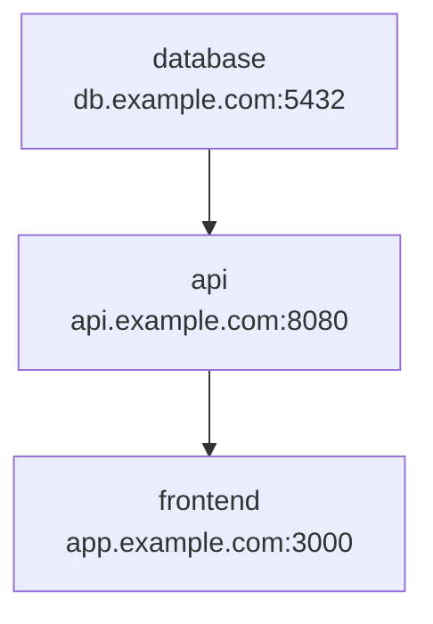

# Arbiter User Guide

Welcome to Arbiter, the real-time collaborative CUE editor! This guide will help you get started with creating, editing, and collaborating on CUE configurations.

## Table of Contents

- [Getting Started](#getting-started)
- [Interface Overview](#interface-overview)
- [Working with Projects](#working-with-projects)
- [CUE Editor Features](#cue-editor-features)
- [Real-time Collaboration](#real-time-collaboration)
- [Analysis and Validation](#analysis-and-validation)
- [Visualization Features](#visualization-features)
- [Keyboard Shortcuts](#keyboard-shortcuts)
- [Tips and Best Practices](#tips-and-best-practices)
- [Troubleshooting](#troubleshooting)

## Getting Started

### Accessing Arbiter

1. **Open your web browser** and navigate to your Arbiter instance:
   - Development: http://localhost:5173
   - Production: Your deployed URL

2. **No login required** - Arbiter currently operates without authentication (coming in future versions)

3. **Browser compatibility**:
   - Chrome 90+ (recommended)
   - Firefox 88+
   - Safari 14+
   - Edge 90+

### First Steps

1. **Create your first project** by clicking the "New Project" button
2. **Enter a project name** (e.g., "My Configuration")
3. **Start editing** - You'll be taken directly to the editor
4. **Invite collaborators** by sharing the URL (they'll join automatically)

## Interface Overview

### Main Layout

```
┌─────────────────────────────────────────────────────────────┐
│ Top Bar: Project name, Save, New Project, Settings         │
├─────────────────────────────────────────────────────────────┤
│                                                             │
│ ┌─────────────────┐ ┌─────────────────────────────────────┐ │
│ │                 │ │                                     │ │
│ │   CUE Editor    │ │      Analysis Panel                │ │
│ │   (Monaco)      │ │   ┌─────────────────────────────┐   │ │
│ │                 │ │   │ Errors/Warnings            │   │ │
│ │                 │ │   └─────────────────────────────┘   │ │
│ │                 │ │   ┌─────────────────────────────┐   │ │
│ │                 │ │   │ Parsed Output              │   │ │
│ │                 │ │   └─────────────────────────────┘   │ │
│ │                 │ │   ┌─────────────────────────────┐   │ │
│ │                 │ │   │ Visualization              │   │ │
│ │                 │ │   └─────────────────────────────┘   │ │
│ └─────────────────┘ └─────────────────────────────────────┘ │
│                                                             │
├─────────────────────────────────────────────────────────────┤
│ Status Bar: Connected users, Analysis status, Save status  │
└─────────────────────────────────────────────────────────────┘
```

### Key Interface Elements

**Top Bar:**
- **Project Name** - Shows current project name
- **Save Button** - Manually save current revision (Ctrl+S)
- **New Project** - Create a new CUE project
- **Connection Status** - Shows WebSocket connection state

**Editor Panel (Left):**
- **Monaco Editor** - Full-featured code editor with syntax highlighting
- **Line Numbers** - Click to jump to specific lines
- **Cursor Indicators** - See other users' cursors in real-time
- **Error Highlights** - Red underlines for syntax/validation errors

**Analysis Panel (Right):**
- **Error/Warning List** - Detailed validation messages
- **Parsed Output** - JSON representation of valid CUE
- **Visualization** - Interactive Mermaid diagrams
- **Analysis Status** - Shows processing state

**Status Bar (Bottom):**
- **Connected Users** - Avatars and names of active collaborators
- **Analysis Timer** - Shows last analysis duration
- **Save Status** - Indicates auto-save state

## Working with Projects

### Creating Projects

1. **Click "New Project"** in the top bar
2. **Enter project details**:
   - Name: Descriptive name for your configuration
   - Description: Optional details about the project
3. **Click "Create"** - You'll be taken to the editor immediately

### Project Management

**Switching Projects:**
- Click the project name in the top bar to see all projects
- Select any project from the list to switch to it
- Recently edited projects appear at the top

**Project Settings:**
- Access via the settings gear icon
- Rename projects
- Delete projects (permanent action)
- View project creation/modification dates

### Revision History

Arbiter automatically saves revisions as you work:

- **Auto-save** happens when you pause typing (after 2 seconds of inactivity)
- **Manual save** with Ctrl+S or the Save button
- **All revisions preserved** - No data is ever lost
- **Revision browsing** - View previous versions (feature coming soon)

## CUE Editor Features

### Syntax Highlighting

The Monaco editor provides rich CUE language support:

```cue
package config

// Basic configuration
name: "my-application"
version: "1.2.3"

// Nested structures with validation
database: {
    host: string
    port: int & >1024 & <65536
    ssl:  bool | *false
}

// Lists and constraints
services: [...{
    name: string
    replicas: int & >=1 & <=10
}]

// Conditional logic
#Environment: "development" | "staging" | "production"
environment: #Environment & "development"

if environment == "production" {
    database: ssl: true
    services: [for s in services {s & {replicas: s.replicas * 2}}]
}
```

**Syntax Features:**
- **Keyword highlighting** - `package`, `import`, `if`, `for`, etc.
- **String literals** - Different colors for strings vs. identifiers
- **Operators** - Mathematical and logical operators highlighted
- **Comments** - Clear distinction between code and comments
- **Brackets** - Matching bracket highlighting

### Code Intelligence

**Auto-completion:**
- Type-based suggestions
- Keyword completion
- Structure completion for objects and lists

**Error Detection:**
- **Syntax errors** - Red underlines for invalid CUE syntax
- **Type errors** - Validation against CUE type system
- **Constraint violations** - When values don't meet defined constraints
- **Reference errors** - Undefined variables or fields

**Bracket Matching:**
- Automatic bracket/brace/parentheses matching
- Click on any bracket to highlight its pair
- Auto-closing of brackets when typing

### Editing Features

**Multi-cursor Editing:**
- Hold Alt and click to create multiple cursors
- Edit multiple locations simultaneously
- Perfect for repetitive edits

**Find and Replace:**
- Ctrl+F to find text
- Ctrl+H for find and replace
- Regular expression support
- Case-sensitive and whole-word options

**Code Folding:**
- Click the arrow icons to collapse sections
- Useful for large configurations
- Nested folding support

**Indentation:**
- Automatic indentation for CUE syntax
- Tab/Shift+Tab to indent/unindent selections
- Configurable indent size (default: 4 spaces)

## Real-time Collaboration

### Joining a Project

**Share the URL:**
- Copy the browser URL from your project
- Send to collaborators via email, Slack, etc.
- They'll automatically join when they open the link

**User Identification:**
- Each user gets a unique color
- Names are generated automatically (customizable in future)
- Up to 10 simultaneous users supported per project

### Collaborative Editing

**Real-time Synchronization:**
- Changes appear instantly for all users
- **Conflict-free** - Uses Y.js CRDT technology
- **No merge conflicts** - Multiple users can edit the same section safely

**Cursor Awareness:**
- See other users' cursors as colored indicators
- View their selections (highlighted in their color)
- Cursor positions update in real-time as they type

**Presence Indicators:**
- User avatars in the status bar
- Color-coded presence throughout the interface
- Join/leave notifications

### Collaboration Best Practices

**Communication:**
- Use comments in CUE code to communicate intent
- Coordinate major changes via external chat/video
- Consider using voice/video for complex discussions

**Working Together:**
- **Divide sections** - Work on different parts of large configs
- **Take turns** - Alternate who makes structural changes
- **Review together** - Use screen sharing for complex validation

**Avoiding Conflicts:**
- **Communicate changes** - Let others know about major edits
- **Small, frequent saves** - Don't hold onto large changes
- **Use comments** - Document complex logic for other users

## Analysis and Validation

### Live Analysis

Arbiter analyzes your CUE code in real-time:

**Analysis Triggers:**
- Automatically after 250ms of no typing
- Manually with Ctrl+Enter
- When switching between projects
- After collaborative edits from other users

**Analysis Process:**
1. **Send to server** - Your CUE code is sent for validation
2. **CUE CLI processing** - Server runs `cue export` on your code
3. **Results returned** - Errors, warnings, and parsed output
4. **UI updated** - Editor highlights errors, panel shows results

### Understanding Errors

**Error Display:**
- **Red underlines** in the editor mark problem areas
- **Error panel** shows detailed error messages
- **Line/column numbers** help locate issues quickly
- **Tooltips** on hover show error details

**Common Error Types:**

**Syntax Errors:**
```cue
// ❌ Missing colon
name "my-app"
// ✅ Correct syntax
name: "my-app"
```

**Type Errors:**
```cue
// ❌ Type mismatch
port: "8080"  // String instead of number
// ✅ Correct type
port: 8080
```

**Constraint Violations:**
```cue
#Port: int & >1024 & <65536
// ❌ Violates constraint
database_port: #Port & 80    // 80 is not > 1024
// ✅ Satisfies constraint
database_port: #Port & 5432
```

**Reference Errors:**
```cue
// ❌ Undefined reference
database: {
    host: unknown_variable
}
// ✅ Valid reference
#DefaultHost: "localhost"
database: {
    host: #DefaultHost
}
```

### Validation Features

**Real-time Feedback:**
- Errors appear as you type
- Warnings for potential issues
- Success indicators when validation passes

**Detailed Error Information:**
- Specific line and column numbers
- Human-readable error descriptions
- Suggestions for fixes when possible

**Performance Limits:**
- 64KB maximum document size
- 750ms timeout for analysis
- Rate limited to prevent server overload

## Visualization Features

### Automatic Diagram Generation

When your CUE validates successfully, Arbiter generates interactive diagrams:

**Mermaid Diagrams:**
- Automatically created from your CUE structure
- Shows relationships between configuration elements
- Interactive - click nodes to explore

**Example Visualization:**
```cue
package webapp

database: {
    host: "db.example.com"
    port: 5432
    name: "webapp_db"
}

api: {
    host: "api.example.com"
    port: 8080
    dependencies: ["database"]
}

frontend: {
    host: "app.example.com" 
    port: 3000
    dependencies: ["api"]
}
```

Generates this diagram:


### Diagram Features

**Interactive Elements:**
- **Click nodes** to highlight related code sections
- **Zoom and pan** to navigate complex diagrams
- **Tooltip information** shows node details

**Diagram Types:**
- **Hierarchical** - Shows nested structure of objects
- **Dependency** - Illustrates relationships between components
- **Flow** - Displays data or process flows

**Large Configuration Handling:**
- Automatically simplifies diagrams with >200 nodes
- Provides summary views for complex structures
- Expandable sections for detailed exploration

### Using Visualizations

**Navigation:**
- Use mouse wheel to zoom in/out
- Click and drag to pan around large diagrams
- Double-click nodes for detailed views

**Understanding Your Config:**
- Visualizations help spot structural issues
- Useful for explaining configurations to others
- Great for documentation and presentations

## Keyboard Shortcuts

### Editor Shortcuts

| Shortcut | Action |
|----------|--------|
| `Ctrl+S` | Save current revision |
| `Ctrl+Z` | Undo last change |
| `Ctrl+Y` | Redo last undone change |
| `Ctrl+F` | Find text |
| `Ctrl+H` | Find and replace |
| `Ctrl+/` | Toggle line comment |
| `Ctrl+Enter` | Trigger analysis manually |
| `Tab` | Indent selection |
| `Shift+Tab` | Unindent selection |
| `Alt+Click` | Create additional cursor |
| `Ctrl+D` | Select next occurrence of current word |

### Navigation Shortcuts

| Shortcut | Action |
|----------|--------|
| `Ctrl+G` | Go to line number |
| `F3` | Find next |
| `Shift+F3` | Find previous |
| `Ctrl+Home` | Go to beginning of document |
| `Ctrl+End` | Go to end of document |
| `Ctrl+Left/Right` | Jump by word |
| `Home` | Go to beginning of line |
| `End` | Go to end of line |

### Advanced Editing

| Shortcut | Action |
|----------|--------|
| `Alt+Up/Down` | Move line up/down |
| `Shift+Alt+Up/Down` | Copy line up/down |
| `Ctrl+Shift+K` | Delete entire line |
| `Ctrl+X` | Cut entire line (when nothing selected) |
| `Ctrl+Shift+L` | Select all occurrences of current word |
| `Ctrl+U` | Undo cursor position |
| `Shift+Alt+I` | Insert cursor at end of each selected line |

## Tips and Best Practices

### Writing Good CUE

**Use Meaningful Names:**
```cue
// ❌ Cryptic names
cfg: {
    h: "localhost"
    p: 8080
}

// ✅ Clear names
database_config: {
    host: "localhost"
    port: 8080
}
```

**Define Constraints:**
```cue
// ✅ Explicit constraints prevent errors
#Port: int & >1024 & <65536
#Environment: "development" | "staging" | "production"

database: {
    port: #Port & 5432
    env: #Environment & "development"
}
```

**Use Comments Liberally:**
```cue
// Application configuration for the user service
package userservice

// Database connection settings
// Note: SSL is required in production
database: {
    host: "user-db.internal"
    port: 5432
    ssl_enabled: true
}

// Rate limiting configuration
// Current limits based on load testing results
rate_limits: {
    requests_per_minute: 1000
    burst_limit: 100
}
```

### Collaboration Tips

**Project Organization:**
- Use clear, descriptive project names
- Include environment in project names (e.g., "webapp-production", "webapp-development")
- Create separate projects for different applications/services

**Code Structure:**
- Group related configuration sections
- Use consistent indentation and formatting
- Break large configurations into logical sections

**Version Management:**
- Save frequently to create revision checkpoints
- Use meaningful commit-like comments in your code
- Coordinate major changes with your team

### Performance Tips

**Large Configurations:**
- Break very large configs into multiple projects
- Use CUE's package system for modularity
- Consider the 64KB size limit for analysis

**Real-time Editing:**
- Pause occasionally when making large changes
- Let analysis complete before making more edits
- Use manual analysis (Ctrl+Enter) for better control

## Troubleshooting

### Connection Issues

**WebSocket Connection Lost:**
- **Symptom:** Red connection indicator, no real-time updates
- **Solution:** Refresh the page to reconnect
- **Prevention:** Check network stability, firewall settings

**Analysis Not Working:**
- **Symptom:** No analysis results, spinning indicator
- **Solution:** Check if CUE syntax is valid, try manual analysis (Ctrl+Enter)
- **Check:** Server logs for CUE CLI issues

### Editor Problems

**Syntax Highlighting Missing:**
- **Cause:** Large documents or browser performance
- **Solution:** Refresh page, break document into smaller projects
- **Workaround:** Continue editing without highlighting

**Slow Performance:**
- **Cause:** Very large documents or many concurrent users
- **Solution:** Optimize CUE structure, reduce document size
- **Alternative:** Use multiple smaller projects

**Cursor Synchronization Issues:**
- **Cause:** Network latency or temporary disconnection  
- **Solution:** Refresh page to resync
- **Workaround:** Coordinate verbally with other users

### Analysis Errors

**"Analysis timeout" Errors:**
- **Cause:** Complex CUE that takes >750ms to process
- **Solution:** Simplify configuration, break into smaller parts
- **Workaround:** Use manual analysis with simpler test cases

**"Import not allowed" Errors:**
- **Cause:** Security restriction in current version
- **Solution:** Remove import statements, inline definitions
- **Future:** Import support coming in later versions

**Persistent Validation Errors:**
- **Cause:** CUE syntax or constraint issues
- **Solution:** Check CUE documentation, validate syntax
- **Help:** Use CUE CLI locally for detailed debugging

### Browser Compatibility

**Features Not Working in Older Browsers:**
- **Solution:** Upgrade to supported browser version
- **Alternatives:** Chrome 90+, Firefox 88+, Safari 14+, Edge 90+

**Mobile/Tablet Usage:**
- **Limitation:** Optimized for desktop, limited mobile support
- **Recommendation:** Use desktop or laptop for best experience

### Getting Help

**Documentation:**
- Check this user guide for common questions
- Review [API.md](API.md) for technical details
- See [CONTRIBUTING.md](CONTRIBUTING.md) for development info

**Community:**
- GitHub Issues for bug reports
- GitHub Discussions for questions
- Project Discord for real-time help

**Reporting Issues:**
- Include browser version and operating system
- Describe steps to reproduce the problem
- Share relevant CUE code (if possible)
- Check browser console for error messages

---

## What's Next?

Arbiter is actively developed with new features coming regularly:

**Planned Features:**
- User authentication and project permissions
- Revision history browsing and diff views
- CUE import statement support
- Advanced visualization options  
- Mobile/tablet optimization
- Plugin system for custom validators

**Stay Updated:**
- Watch the GitHub repository for releases
- Join our Discord community for announcements
- Follow the project roadmap for upcoming features

Happy CUE editing! 🚀