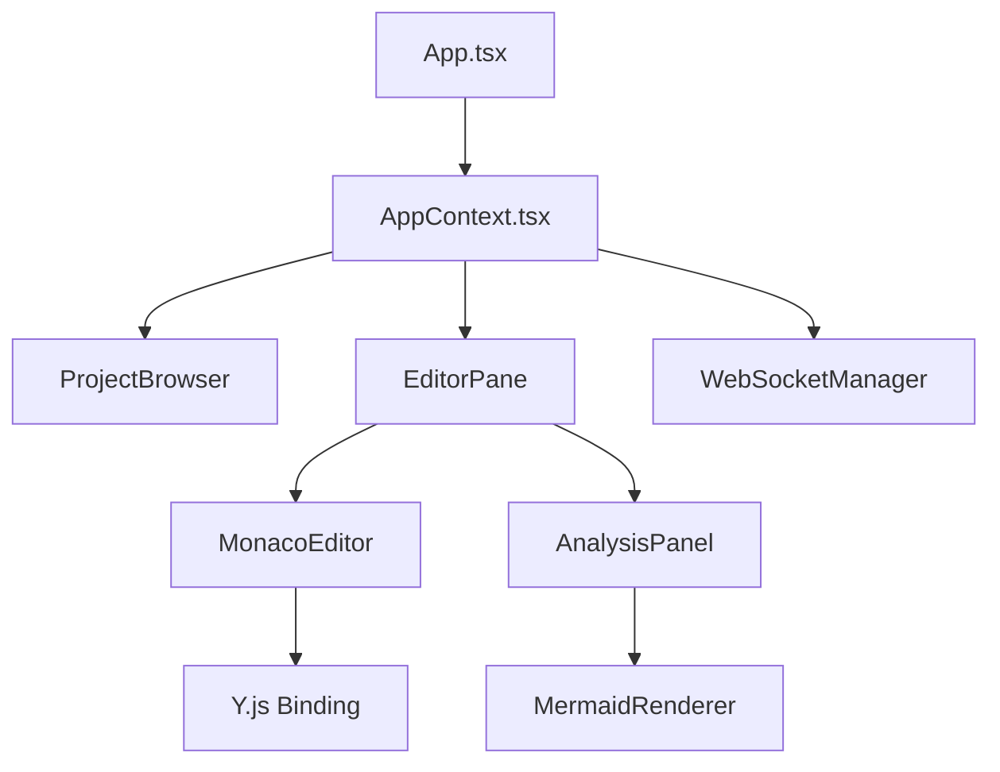

# Arbiter Web Frontend

The Arbiter web frontend is a modern React application that provides a real-time collaborative CUE editor with live analysis and visualization capabilities.

## Features

- **Monaco Editor Integration** - Rich code editing with CUE syntax highlighting
- **Real-time Collaboration** - Multi-user editing with Y.js CRDT synchronization
- **Live CUE Analysis** - Real-time validation and error reporting as you type
- **Interactive Visualization** - Automatic Mermaid diagram generation from CUE structure
- **Project Management** - Create, edit, and manage CUE configuration projects
- **Cursor Awareness** - See other users' cursors and selections in real-time
- **Responsive Design** - Works on desktop and tablet devices

## Tech Stack

- **React** 18.x - UI framework with hooks and functional components
- **TypeScript** - Type safety and developer experience
- **Vite** - Fast build tool and development server
- **Monaco Editor** - VS Code's editor for the web
- **Y.js** - CRDT for conflict-free collaborative editing
- **Mermaid** - Diagram generation and visualization
- **Tailwind CSS** - Utility-first CSS framework
- **Vitest** - Unit testing framework

## Quick Start

### Development

```bash
# Install dependencies (from project root)
bun install

# Start development server
bun run --cwd apps/web dev

# App will be available at http://localhost:5173
```

### Build for Production

```bash
# Build optimized production bundle
bun run --cwd apps/web build

# Preview production build
bun run --cwd apps/web preview
```

## Project Structure

```
apps/web/
├── src/
│   ├── App.tsx                 # Main application component
│   ├── components/             # React components
│   │   ├── Editor/            # Monaco editor integration
│   │   ├── Layout/            # Layout and navigation components
│   │   ├── ProjectShowcase.tsx
│   │   └── diagrams/          # Mermaid visualization components
│   ├── contexts/              # React context providers
│   │   └── AppContext.tsx     # Global application state
│   ├── design-system/         # Reusable UI components
│   ├── hooks/                 # Custom React hooks
│   │   └── useWebSocket.ts    # WebSocket connection management
│   ├── services/              # API and WebSocket services
│   │   ├── api.ts            # HTTP API client
│   │   └── websocket.ts      # WebSocket client
│   ├── types/                 # TypeScript type definitions
│   └── main.tsx              # Application entry point
├── public/                    # Static assets
├── index.html                # HTML template
├── package.json              # Dependencies and scripts
├── vite.config.ts           # Vite configuration
└── tailwind.config.js       # Tailwind CSS configuration
```

## Key Components

### Editor System

**`MonacoEditor`** - Core editor component with:
- CUE syntax highlighting and validation
- Real-time collaborative editing via Y.js
- Cursor position tracking and sharing
- Auto-save and manual save functionality

**`EditorPane`** - Editor container with:
- Analysis panel integration
- Error display and highlighting
- File tree navigation
- Split-pane layout management

### Project Management

**`ProjectBrowser`** - Project selection interface
**`ProjectList`** - Grid view of available projects
**`TopBar`** - Navigation and project controls

### Real-time Features

**`WebSocketManager`** - Handles WebSocket connections and message routing
**`PresenceManager`** - Manages user presence and cursor tracking
**`YjsBinding`** - Binds Y.js CRDT to Monaco editor

### Visualization

**`MermaidRenderer`** - Converts CUE analysis results to Mermaid diagrams
**`DiagramShowcase`** - Interactive diagram display with zoom and pan
**`DataViewer`** - JSON/YAML output visualization

## Configuration

### Environment Variables

The frontend uses Vite's environment variable system:

```bash
# .env.local
VITE_API_URL=http://localhost:3001    # API server endpoint
VITE_WS_URL=ws://localhost:3001       # WebSocket endpoint
```

### Build Configuration

**`vite.config.ts`** - Vite build configuration:
- Monaco Editor integration
- Development proxy setup
- Production optimization
- Asset handling

**`tailwind.config.js`** - Tailwind CSS configuration:
- Custom color palette
- Component classes
- Responsive breakpoints

## Development

### Running Tests

```bash
# Run unit tests
bun run --cwd apps/web test

# Run tests in watch mode
bun run --cwd apps/web test --watch

# Run tests with coverage
bun run --cwd apps/web test --coverage
```

### Storybook (Component Development)

```bash
# Start Storybook development server
bun run --cwd apps/web storybook

# Build Storybook for production
bun run --cwd apps/web build-storybook
```

### Code Quality

```bash
# Type checking
bun run --cwd apps/web typecheck

# Linting
bun run --cwd apps/web lint

# Code formatting
bun run format
```

## Architecture

### State Management

The app uses React Context for global state management:

```typescript
// AppContext provides:
interface AppContextType {
  projects: Project[];
  currentProject: Project | null;
  isConnected: boolean;
  users: CollaborationUser[];
  analysisResult: AnalysisResult | null;
}
```

### Real-time Collaboration Flow

1. **Connection** - WebSocket connection established on app load
2. **Authentication** - User information shared with server
3. **Project Joining** - Select project triggers join message
4. **Document Sync** - Y.js document synchronized with server
5. **Live Editing** - Changes propagated via Y.js updates
6. **Presence Sharing** - Cursor positions shared via WebSocket
7. **Analysis Broadcasting** - Analysis results shared with all users

### Component Communication



## Performance Optimizations

### Editor Performance

- **Monaco Editor Virtualization** - Handles large documents efficiently
- **Debounced Analysis** - 250ms delay before triggering analysis
- **Component Memoization** - React.memo for expensive components
- **Lazy Loading** - Code splitting for non-critical components

### Network Optimization

- **Binary WebSocket Messages** - Efficient Y.js update transmission
- **Connection Pooling** - Reuse WebSocket connections
- **Request Deduplication** - Avoid duplicate analysis requests
- **Optimistic Updates** - UI updates before server confirmation

### Bundle Optimization

- **Tree Shaking** - Remove unused code from bundles
- **Code Splitting** - Dynamic imports for route-based chunks
- **Asset Optimization** - Image compression and caching
- **Monaco Worker** - Web worker for syntax highlighting

## Accessibility

The frontend includes comprehensive accessibility features:

- **Keyboard Navigation** - Full app navigation via keyboard
- **Screen Reader Support** - ARIA labels and semantic HTML
- **High Contrast Mode** - Support for system preference
- **Focus Management** - Proper focus flow and visual indicators
- **Error Announcements** - Screen reader announcements for analysis errors

## Browser Support

- **Chrome** 90+ (primary development target)
- **Firefox** 88+
- **Safari** 14+
- **Edge** 90+

Features gracefully degrade on older browsers with polyfills where necessary.

## Deployment

### Static Build

The web app builds to static files for deployment:

```bash
# Build production bundle
bun run --cwd apps/web build

# Output in dist/ directory
ls apps/web/dist/
# index.html, assets/, etc.
```

### Docker Deployment

See [DEPLOYMENT.md](../../DEPLOYMENT.md) for containerized deployment instructions.

### CDN Deployment

The static build can be deployed to any CDN or static hosting service:
- Vercel
- Netlify
- AWS S3 + CloudFront
- GitHub Pages

## Testing

### Unit Tests

Tests use Vitest and React Testing Library:

```typescript
// Component test example
import { render, screen } from '@testing-library/react';
import { ProjectList } from '../ProjectList';

test('displays projects correctly', () => {
  render(<ProjectList projects={mockProjects} />);
  expect(screen.getByText('My Project')).toBeInTheDocument();
});
```

### Integration Tests

Tests cover component interactions:
- WebSocket connection handling
- Y.js document synchronization
- Analysis request/response flow
- User presence management

### E2E Tests

End-to-end tests using Playwright cover:
- Project creation and editing
- Real-time collaboration scenarios
- Analysis and visualization features
- Error handling and recovery

## Troubleshooting

### Common Issues

**Monaco Editor not loading:**
```bash
# Ensure Monaco is properly configured in vite.config.ts
# Check console for asset loading errors
```

**WebSocket connection fails:**
```bash
# Verify API server is running
curl http://localhost:3001/projects

# Check CORS configuration
# Ensure WebSocket URL is correct
```

**Y.js sync issues:**
```bash
# Clear browser storage
localStorage.clear();

# Check WebSocket message flow in dev tools
# Verify Y.js update persistence in API server
```

### Development Tips

1. **Use React DevTools** - Inspect component state and props
2. **Monitor Network Tab** - Watch WebSocket messages and API calls
3. **Check Console Logs** - Application logs helpful for debugging
4. **Test Collaboration** - Open multiple browser tabs for multi-user testing

## Contributing

See [CONTRIBUTING.md](../../CONTRIBUTING.md) for development guidelines and contribution process.

For bug reports and feature requests, please use the GitHub issue tracker.