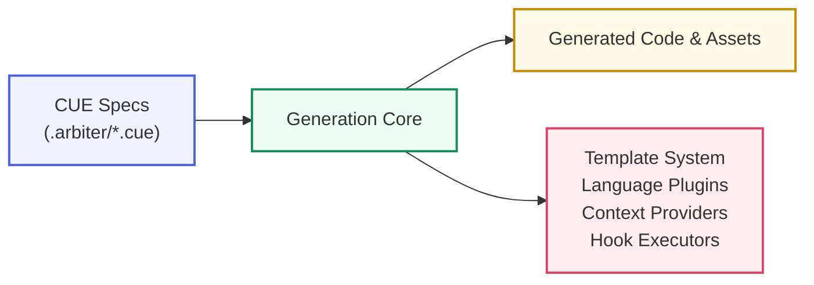

# Arbiter Code Generation Architecture

This document provides a comprehensive overview of Arbiter's code generation system, covering the complete pipeline from CUE specifications to generated code artifacts.

## Table of Contents

- [Architecture Overview](#architecture-overview)
- [Generation Pipeline](#generation-pipeline)
- [Core Components](#core-components)
- [Template System](#template-system)
- [Configuration System](#configuration-system)
- [Language Plugins](#language-plugins)
- [Context Providers](#context-providers)
- [Hooks and Customization](#hooks-and-customization)

## Architecture Overview

Arbiter's code generation system follows a modular, extensible architecture designed to transform CUE specifications into production-ready code artifacts across multiple languages and frameworks.

### Core Principles

1. **Specification-Driven**: All generation is driven by CUE specifications that define complete application architecture
2. **Multi-Language Support**: Pluggable language system supporting TypeScript, Python, Rust, Go, and more
3. **Template-Based**: Flexible template engine with override capabilities
4. **Hook-Based Extension**: Comprehensive hook system for custom generation logic
5. **Context-Aware**: Rich context providers that extract meaningful data from specifications

### System Components



## Generation Pipeline

The generation pipeline consists of five main phases:

### 1. Specification Discovery and Loading

- Discovers CUE specification files in `.arbiter/` directories
- Loads and validates specifications against the unified Arbiter application schema
- Resolves spec fragments and imports
- Validates specification completeness

```typescript
// Entry point: packages/cli/src/commands/generate.ts
export async function generateCommand(
  options: GenerateOptions,
  config: CLIConfig,
  specName?: string,
): Promise<number>
```

### 2. Context Resolution

- Creates generation contexts for services and clients
- Extracts variables and metadata from CUE specifications
- Resolves project structure and output directories
- Prepares language-specific contexts

```typescript
// Context creation in packages/cli/src/services/generate/index.ts
function createClientContext(
  appSpec: AppSpec,
  structure: ProjectStructureConfig,
  outputDir: string,
): ClientGenerationContext

function createServiceContext(
  serviceName: string,
  serviceConfig: any,
  structure: ProjectStructureConfig,
  outputDir: string,
): ServiceGenerationContext
```

### 3. Template Resolution and Processing

- Resolves templates from override directories and defaults
- Streams the full context payload into the declared engine command (any executable)
- Built-in helpers call the same interface directly for performance but remain opt-in
- Applies template inheritance/composition before execution

### 4. Code Generation

- Executes language-specific generators via plugin system
- Generates services, components, Docker configurations, CI/CD pipelines
- Applies hooks for custom generation logic
- Handles file writing with proper permissions

### 5. Post-Generation Processing

- Validates generated code structure
- Executes post-generation hooks
- Updates project manifests and configurations
- Optionally synchronizes with GitHub repositories

## Core Components

### GenerateService (`packages/cli/src/services/generate/index.ts`)

The main orchestrator that coordinates the entire generation process.

**Key Features:**
- Spec discovery and validation
- Context preparation
- Template processing coordination
- Error handling and reporting
- Dry-run support

**Main Methods:**
- `generateCommand()` - Primary entry point
- `discoverSpecs()` - Finds available specifications
- `createClientContext()` - Sets up client generation context
- `createServiceContext()` - Sets up service generation context

### Hook Executor (`packages/cli/src/services/generate/hook-executor.ts`)

Manages the execution of generation hooks for customization.

**Features:**
- File write hooks with before/after processing
- Directory creation with dry-run support
- Active hook manager state management

```typescript
export async function writeFileWithHooks(
  filePath: string,
  content: string,
  options: GenerateOptions,
  mode?: number,
): Promise<void>

export async function ensureDirectory(
  dir: string, 
  options: GenerateOptions
): Promise<void>
```

### Template Runner (`packages/cli/src/services/generate/template-runner.ts`)

Bridges the generation system with language-specific plugins.

**Capabilities:**
- Language plugin configuration
- Template override resolution
- Testing configuration management
- Workspace root configuration

> **Template Runner vs. Template Engines**
>
> The template runner never renders source files itself. Its job is to locate the correct language plugin, configure overrides, and hand the plugin a `TemplateContext`. Plugins can then:
> 1. Call the pluggable **Template Engine** interface to execute external templates (cookiecutter, scripts, etc.), or
> 2. Render programmatically (e.g., write TypeScript ASTs) while still using the same `TemplateContext`.
>
> This separation keeps the CLI deterministic: the runner orchestrates *what* should be generated, the engines decide *how* the bytes are produced.

## Template System

This section focuses on how the generation pipeline invokes templates. For step‑by‑step authoring guidance, see the [Template Development Guide](./template-development-guide.md).

### Template Runner Responsibilities

The template runner (inside `services/generate/template-runner.ts`) orchestrates _when_ templates are invoked:

- Resolves language plugins and template overrides based on CLI config
- Builds the canonical `TemplateContext { project, parent, artifact, impl }`
- Hands that context to either internal renderers (Handlebars) or external engines (cookiecutter, scripts, etc.)

Plugins can still emit code programmatically, but they use the same context object to ensure determinism.

### Internal Template Engine (Handlebars by default)

Arbiter’s built-in service/client templates use Handlebars (`*.hbs`) when `arbiter generate` runs. Commands like `arbiter add service --template ts-fastify` only store template metadata inside the spec. The actual rendering happens during `arbiter generate`, where the engine loads the Handlebars bundle, binds the `TemplateContext`, and writes the files. The same Handlebars stack powers the repository bootstrap templates documented in the Template Development Guide.

- **Pros:** Fast, ships with the CLI, supports partials/inheritance, no external runtime needed.
- **Cons:** Limited to what Handlebars can do; advanced logic often moves into helpers.

### External Template Engines

If you prefer another engine, declare it in `.arbiter/templates.json`. When you reference that alias, Arbiter shells out to the command you specified and streams the full JSON context via stdin/environment. The command can be anything—`bunx handlebars`, `python render.py`, `cookiecutter`, or a bespoke binary. Whatever it prints to stdout becomes the generated artifact, so you can adopt any templating stack without modifying the CLI.

The built-in helpers (such as the cookiecutter shortcut that powers `arbiter add service --template ...`) follow this same contract. Instead of spawning a process they call the library directly for performance, but they still receive `{command, args, context}` just like user-defined engines. Swapping engines is therefore just a matter of editing your template config.

### Template Engine Interface

The template system provides a pluggable architecture for different template processors:

```typescript
export interface TemplateEngine {
  name: string;
  command: string;
  defaultArgs: string[];
  validate?(source: string): Promise<boolean>;
  execute(source: string, destination: string, context: TemplateContext): Promise<void>;
}
```

### Template Configuration

Templates are configured through a hierarchical system:

```typescript
export interface TemplateConfig {
  engines: Record<string, TemplateEngineConfig>;
  aliases: Record<string, TemplateAlias>;
  settings?: {
    defaultEngine?: string;
    cacheDir?: string;
    timeout?: number;
  };
}
```

### Template Resolution

Templates are resolved through the `TemplateResolver` class with the following priority:

1. **Override Directories** - Custom user templates
2. **Default Directories** - Built-in templates
3. **Fallback Content** - Hard-coded defaults

```typescript
export class TemplateResolver {
  async renderTemplate(
    templatePath: string,
    context: Record<string, unknown>,
    fallback: string,
  ): Promise<string>
}
```

### Template Variables

Templates support two types of variable interpolation:

- `{{ variable }}` - Simple variable substitution
- `{{{ variable }}}` - Complex object serialization (JSON)

**Variable Context Structure:**
```typescript
export interface TemplateContext {
  /**
   * Entire application spec (already normalized/augmented).
   * Template engines can reach any part of the project without re-querying.
   */
  project: Record<string, unknown>;

  /**
   * Parent artifact, if this template renders something nested
   * (e.g., an endpoint template gets the owning service as the parent).
   */
  parent?: Record<string, unknown>;

  /**
   * The concrete artifact being rendered (service, client, endpoint, route, etc).
   * This is always present and mirrors the structure from the CUE spec.
   */
  artifact: Record<string, unknown>;

  /**
   * Implementation metadata computed by the generator (paths, language hints,
   * derived names). Nothing in here comes from user specs, so template authors
   * can safely treat it as helper data.
   */
  impl?: Record<string, unknown>;
}
```

## Configuration System

### Generation Options

The `GenerateOptions` interface defines all configurable aspects of generation:

```typescript
export interface GenerateOptions {
  outputDir?: string;        // Output directory for generated code
  force?: boolean;           // Overwrite existing files
  dryRun?: boolean;         // Preview mode without file writes
  verbose?: boolean;         // Detailed logging
  spec?: string;            // Specific spec to generate
  syncGithub?: boolean;     // Sync to GitHub after generation
  githubDryRun?: boolean;   // Preview GitHub sync
}
```

### CLI Configuration Integration

The generation system integrates with the broader CLI configuration:

```typescript
export function configureLanguagePluginRuntime(
  language: string, 
  cliConfig: CLIConfig
): void {
  const generatorConfig = cliConfig.generator;
  const overridesEntry = generatorConfig?.templateOverrides?.[language];
  // ... configure language-specific settings
}
```

## Language Plugins

### Plugin System Architecture

Language plugins provide specialized code generation for different programming languages and frameworks.

**Core Interfaces:**
```typescript
export interface ComponentConfig {
  name: string;
  type: "page" | "component" | "layout" | "hook" | "util";
  props?: ComponentProp[];
  dependencies?: string[];
  styles?: boolean;
  tests?: boolean;
  testId?: string;
}

export interface ServiceConfig {
  name: string;
  type: "api" | "service" | "handler" | "middleware" | "model";
  endpoints?: string[];
  database?: boolean;
  auth?: boolean;
  validation?: boolean;
  methods?: Array<Record<string, any>>;
}
```

### Supported Languages

Current language plugin support:
- **TypeScript/Node.js** - Full-stack web applications
- **Python** - FastAPI services and data processing
- **Rust** - High-performance services with Axum
- **Go** - Microservices and CLI tools

### Plugin Configuration

Language plugins are configured through the CLI config:

```typescript
languageRegistry.configure(language, {
  templateOverrides: resolvedOverrides,
  pluginConfig: generatorConfig?.plugins?.[language],
  workspaceRoot: cliConfig.projectDir,
  testing: getLanguageTestingConfig(generatorConfig?.testing, language),
});
```

## Context Providers

### Generation Contexts

Generation contexts provide structured data to templates and generators:

#### Client Generation Context
```typescript
export interface ClientGenerationContext {
  slug: string;      // URL-safe project identifier
  root: string;      // Root directory path
  routesDir: string; // Routes directory path
}
```

#### Service Generation Context
```typescript
export interface ServiceGenerationContext {
  name: string;        // Service name (slugified)
  root: string;        // Service root directory
  routesDir: string;   // Routes directory
  language: string;    // Programming language
  originalName?: string; // Original service name
}
```

### Context Creation

Contexts are created from CUE specifications during the resolution phase:

```typescript
// Client context from app specification
const clientContext = createClientContext(
  appSpec,
  projectStructure,
  outputDir
);

// Service context from service configuration
const serviceContext = createServiceContext(
  serviceName,
  serviceConfig,
  projectStructure,
  outputDir
);
```

## Hooks and Customization

### Generation Hook System

The generation system provides hooks for customizing the generation process:

```typescript
export class GenerationHookManager {
  async beforeFileWrite(
    filePath: string, 
    content: string
  ): Promise<string>;
  
  async afterFileWrite(
    filePath: string, 
    content: string
  ): Promise<void>;
}
```

### Hook Integration

Hooks are integrated throughout the generation pipeline:

1. **Pre-Generation Hooks** - Setup and validation
2. **File Write Hooks** - Content transformation
3. **Post-Generation Hooks** - Cleanup and finalization

### Custom Hook Implementation

Implement custom hooks by extending the `GenerationHookManager`:

```typescript
class CustomHookManager extends GenerationHookManager {
  async beforeFileWrite(filePath: string, content: string): Promise<string> {
    // Apply custom transformations
    return transformedContent;
  }
  
  async afterFileWrite(filePath: string, content: string): Promise<void> {
    // Perform post-write actions
  }
}
```

## Error Handling and Validation

### Validation Pipeline

The generation system includes comprehensive validation:

1. **Specification Validation** - CUE schema validation
2. **Template Validation** - Template syntax checking
3. **Output Validation** - Generated code validation
4. **Dependency Validation** - Required tool availability

### Error Recovery

The system implements graceful error recovery:

- **Dry Run Mode** - Preview generation without side effects
- **Partial Generation** - Continue on non-critical errors
- **Rollback Support** - Undo incomplete generations
- **Detailed Logging** - Comprehensive error reporting

## Integration Points

### API Server Integration

The generation system integrates with the Arbiter API server for:
- Specification validation
- Real-time generation status
- WebSocket event broadcasting
- Shared storage coordination

### CI/CD Integration

Generated projects include CI/CD configurations for:
- **GitHub Actions** - Automated testing and deployment
- **Docker Compose** - Container orchestration
- **Kubernetes** - Production deployment manifests

### External Tool Integration

The system integrates with external tools:
- **CUE CLI** - Specification validation
- **Docker** - Container builds
- **Git** - Version control
- **Package Managers** - Dependency installation

## Performance Considerations

### Optimization Strategies

1. **Lazy Loading** - Load plugins and templates on demand
2. **Caching** - Cache parsed templates and contexts
3. **Parallel Processing** - Generate multiple services concurrently
4. **Incremental Generation** - Only regenerate changed files

### Resource Management

- **Memory Management** - Efficient context handling
- **File I/O Optimization** - Batch file operations
- **Template Compilation** - Pre-compile templates when possible
- **Plugin Lifecycle** - Efficient plugin loading/unloading

This architecture provides a robust, extensible foundation for code generation that scales from simple prototypes to complex production applications.
