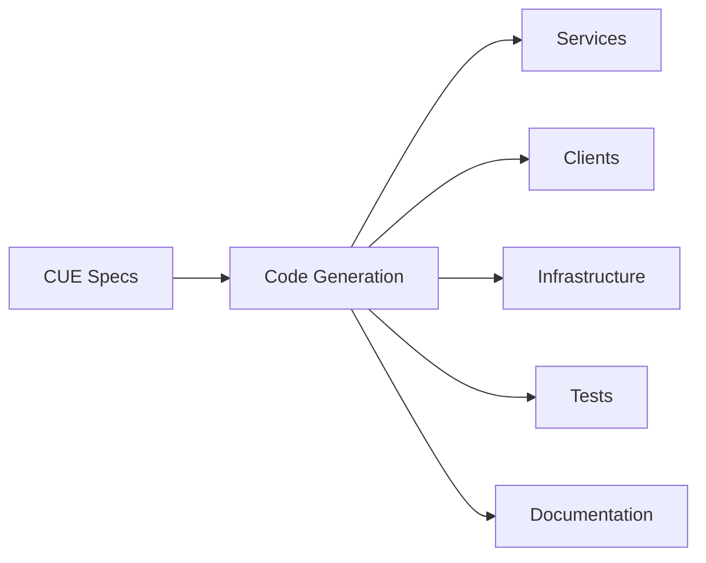

# Arbiter Code Generation System Documentation

Welcome to the comprehensive documentation for Arbiter's code generation system. This collection of guides provides everything you need to understand, configure, and extend Arbiter's powerful code generation capabilities.

## Documentation Overview

This documentation suite covers all aspects of Arbiter's code generation system, from basic usage to advanced customization and extension.

### 📋 Quick Navigation

| Document | Purpose | Audience |
|----------|---------|----------|
| [Architecture Overview](../guides/code-generation-architecture.md) | System design and components | Architects, Senior Developers |
| [Configuration Guide](../guides/code-generation-configuration.md) | Setup and configuration | All Developers |
| [Template Development](../guides/template-development-guide.md) | Creating custom templates | Template Authors |
| [Best Practices](../guides/generation-best-practices.md) | Patterns and guidelines | All Users |
| [API Reference](../reference/api/generation-api-reference.md) | Programmatic interfaces | Plugin Developers |

## Getting Started

### Prerequisites

Before using Arbiter's code generation system, ensure you have:

- **Bun** or **Node.js** runtime
- **CUE CLI** for specification validation
- **Git** for version control
- **Docker** (optional, for containerized generation)

### Quick Start

1. **Install Arbiter CLI**
   ```bash
   bun install -g @sibyllinesoft/arbiter-cli
   # or
   npm install -g @sibyllinesoft/arbiter-cli
   ```

2. **Initialize a new project from a preset**
   ```bash
   # Create a full-stack web app with client, API service, and database
   arbiter init my-app --preset web-app
   cd my-app
   ```

   This creates a complete specification with:
   - A React frontend client
   - A TypeScript API service
   - A PostgreSQL database
   - Pre-configured routing and endpoints

3. **Add acceptance criteria (BDD)**
   ```bash
   # Define behavior using Given/When/Then syntax
   arbiter add behavior "place order" \
     --given "a customer with items in cart" \
     --when "they submit the order" \
     --then "an order is created" \
     --and-then "inventory is reserved" \
     --and-then "confirmation email is sent"
   ```

   This creates executable acceptance tests and living documentation from your business requirements.

4. **Generate code**
   ```bash
   arbiter generate
   ```

That's it! You now have a generated full-stack application ready for development. Use `arbiter list service` and `arbiter list client` to see what was created.

## Layered Walkthrough: FastAPI + Postgres + Vue

To connect the [four-layer model](./core-concepts.md) with day-to-day work, the following example walks through the exact CLI commands used to scaffold a small order-tracking slice with a **Postgres database**, a **Python FastAPI backend**, and a **Vue front end**. Each step corresponds to a layer so you can see how the specification evolves before any code is generated.

### Layer 1 — Domain: Describe the schema

We always begin with the domain vocabulary. Instead of editing CUE by hand, define your schema via the CLI using either JSON Schema or CUE format.

#### Why CUE for Schemas?

CUE combines the readability of JSON with powerful type constraints:

- **Expressive constraints** — Define patterns, ranges, enums, and complex validation rules in one place
- **Catches errors early** — Invalid configurations fail at definition time, not runtime
- **Composable** — Schemas can extend and reference each other without duplication
- **Tool-agnostic** — The same schema generates Zod validators, Pydantic models, SQL migrations, and more

You're not locked into any particular database, ORM, or validation library. Define the shape once; Arbiter generates the right code for each target.

**Option A: JSON Schema format** (use `--format json-schema`)

```json
{
  "required": ["id", "customerId", "status", "total"],
  "fields": {
    "id": { "type": "string", "pattern": "^ord_[a-z0-9]+$" },
    "customerId": { "type": "string", "pattern": "^cust_[a-z0-9]+$" },
    "status": { "enum": ["draft", "submitted", "fulfilled"] },
    "total": { "type": "number", "minimum": 0 },
    "lines": {
      "type": "list",
      "items": {
        "type": "struct",
        "fields": {
          "sku": { "type": "string" },
          "quantity": { "type": "int", "minimum": 1 }
        }
      }
    }
  }
}
```

**Option B: CUE format** (use `--format cue`)

```cue
required: ["id", "customerId", "status", "total"]
fields: {
  id:         { type: "string", pattern: "^ord_[a-z0-9]+$" }
  customerId: { type: "string", pattern: "^cust_[a-z0-9]+$" }
  status:     { enum: ["draft", "submitted", "fulfilled"] }
  total:      { type: "number", minimum: 0 }
  lines: {
    type: "list"
    items: {
      type: "struct"
      fields: {
        sku:      { type: "string" }
        quantity: { type: "int", minimum: 1 }
      }
    }
  }
}
```

Add the schema via CLI:

```bash
# Using JSON Schema (save to file first, then reference)
arbiter add schema Order --type model --format json-schema < order.schema.json

# Or inline for simple schemas
arbiter add schema Order --type model --format json-schema \
  --fields 'id:string,customerId:string,status:enum(draft|submitted|fulfilled),total:number'
```

#### Define Acceptance Criteria

Product owners can also define expected behaviors using Given/When/Then syntax. These become both living documentation and executable tests:

```bash
# Define the happy path for order submission
arbiter add behavior "submit order" \
  --given "a draft order with valid line items" \
  --when "the customer submits the order" \
  --then "the order status changes to submitted" \
  --and-then "the order total is calculated" \
  --and-then "an OrderSubmitted event is emitted"

# Define validation behavior
arbiter add behavior "reject empty order" \
  --given "a draft order with no line items" \
  --when "the customer attempts to submit" \
  --then "the submission is rejected" \
  --and-then "an error message explains the issue"
```

These flows capture business rules in terms stakeholders understand, and Arbiter generates test scaffolding that verifies the system behaves as specified.

This produces a clean entry in `.arbiter/assembly.cue`:

```cue
components: schemas: {
  Order: {
    required: ["id", "customerId", "status", "total"]
    fields: {
      id:         { type: "string", pattern: "^ord_[a-z0-9]+$" }
      customerId: { type: "string", pattern: "^cust_[a-z0-9]+$" }
      status:     { enum: ["draft", "submitted", "fulfilled"] }
      total:      { type: "number", minimum: 0 }
      lines: {
        type: "list"
        items: {
          type: "struct"
          fields: {
            sku:      { type: "string" }
            quantity: { type: "int", minimum: 1 }
          }
        }
      }
    }
  }
}
```

Running `arbiter check --section domain` validates that every downstream layer can rely on this schema.

> **What you gain:** A single source of truth for your data model and business rules. From this one `Order` schema and its flows, Arbiter can generate:
> - PostgreSQL table definitions and migrations
> - Pydantic models for FastAPI request/response validation
> - TypeScript interfaces for your Vue frontend
> - Zod schemas for runtime validation
> - Test scaffolding from your Given/When/Then flows
> - OpenAPI documentation
>
> Change the schema once, regenerate, and every layer stays in sync. Product owners define *what* the system should do; engineers implement *how*.

### Layer 2 — Contracts: Bind the operations

With the shape of an order defined, attach operations via the CLI. Each `arbiter add endpoint` call wires the HTTP intent into the spec and lines up with the schema above.

```bash
arbiter add endpoint /orders \
  --method POST \
  --service orders-api \
  --description "Create an order" \
  --auth bearer

arbiter add endpoint /orders/{id} \
  --method GET \
  --service orders-api
```

Define the contract for those operations once so services can reference it rather than re-implementing behavior:

```bash
arbiter add contract OrderAPI \
  --version 2025-01-01 \
  --summary "Customer order API"

arbiter add contract-operation OrderAPI createOrder \
  --input-key order \
  --input-schema Order \
  --output-key order \
  --output-schema Order

arbiter add contract-operation OrderAPI getOrder \
  --output-key order \
  --output-schema Order
```

Resulting section in `.arbiter/assembly.cue` shows the CLI-managed contract block:

```cue
paths: {
  orders-api: {
    "/orders": {
      post: {
        summary: "Create an order"
        security: [{ bearerAuth: [] }]
        implements: "operations.OrderAPI.operations.createOrder"
        responses: {
          "201": {
            description: "Created"
            content: {
              "application/json": { schema: components.schemas.Order }
            }
          }
        }
      }
    }
    "/orders/{id}": {
      get: {
        summary: "Fetch an order"
        implements: "operations.OrderAPI.operations.getOrder"
        responses: {
          "200": {
            description: "OK"
            content: {
              "application/json": { schema: components.schemas.Order }
            }
          }
        }
      }
    }
  }
}

contracts: workbehaviors: {
  OrderAPI: {
    version: "2025-01-01"
    summary: "Customer order API"
    operations: {
      createOrder: {
        input: {
          order: {
            $ref: "#/components/schemas/Order"
          }
        }
        output: {
          order: {
            $ref: "#/components/schemas/Order"
          }
        }
      }
      getOrder: {
        output: {
          order: {
            $ref: "#/components/schemas/Order"
          }
        }
      }
    }
  }
}
```

This is the "Contracts" layer from the overview—a transport-aware but domain-driven description of how clients will talk to the system.

> **What you gain:** API contracts that are enforceable across your entire stack:
> - OpenAPI specs generated automatically for documentation and client SDKs
> - Request/response validation that matches your schema constraints
> - Type-safe API clients for any language your frontends use
> - Breaking change detection when contracts evolve
>
> The contract lives in the spec, not scattered across controller decorators or route definitions.

### Layer 3 — Capabilities: Compose services

Next we introduce the concrete capabilities that satisfy the contracts. This is where the versatility of `arbiter add` shines:

```bash
# Database (stateful pre-built image)
arbiter add database orders-db --type postgres --port 5432

# Python FastAPI backend via the default cookiecutter alias
arbiter add service orders-api \
  --language python \
  --template python-fastapi \
  --port 8000

# Vue front end registered as a client
arbiter add client customer-ui \
  --template vue-vite \
  --language typescript

# Wire the UI route and component so specs stay synchronized
arbiter add component OrdersBoard --framework vue --directory apps/customer-ui/src/components
arbiter add route /orders --component OrdersBoard
```

Register the Vue alias once (globally in `~/.arbiter/templates.json` or inside `.arbiter/templates.json`) so the CLI knows how to resolve `vue-vite`:

```json
{
  "aliases": {
    "vue-vite": {
      "implementor": "cookiecutter",
      "source": "gh:arbiter-templates/vue-vite",
      "description": "Vue 3 + Vite starter with Pinia + Vitest"
    }
  }
}
```

After these commands, the `services` block captures the FastAPI API plus the external Postgres dependency, and the `clients` section records the Vue front end. No manual editing was required; the CLI wrote every field on your behalf.

```cue
services: {
  orders-db: {
    type: "external"
    workload: "statefulset"
    language: "container"
    image: "postgres:15"
    ports: [{ name: "db", port: 5432 }]
    volumes: [{
      name: "orders-db-data"
      type: "persistentVolumeClaim"
      size: "50Gi"
    }]
  }
  orders-api: {
    type: "internal"
    workload: "deployment"
    language: "python"
    template: "python-fastapi"
    implements: {
      apis: ["operations.OrderAPI"]
    }
    ports: [{ name: "http", port: 8000 }]
    dependencies: {
      database: {
        service: "orders-db"
        description: "Primary write store"
      }
    }
    endpoints: {
      createOrder: {
        path: "/orders"
        methods: ["POST"]
        implements: "operations.OrderAPI.operations.createOrder"
        handler: {
          type: "module"
          module: "orders-api/handlers/orders"
          function: "createOrder"
        }
      }
      getOrder: {
        path: "/orders/{id}"
        methods: ["GET"]
        implements: "operations.OrderAPI.operations.getOrder"
        handler: {
          type: "module"
          module: "orders-api/handlers/orders"
          function: "getOrder"
        }
      }
    }
  }
}
clients: {
  customer-ui: {
    language: "typescript"
    template: "vue-vite"
    sourceDirectory: "clients/customer-ui"
  }
}
```

> Those explicit `handler.module` entries are optional overrides intended for brownfield projects or specs synchronized with existing repositories. When Arbiter controls the directory layout, leave them undefined and the generator will derive handler paths from the service metadata.

> **What you gain:** Mix-and-match technology choices without rewriting your spec:
> - Swap PostgreSQL for MySQL or MongoDB — the schema adapts
> - Switch from FastAPI to Django or Express — contracts stay the same
> - Replace Vue with React or Svelte — routes and components regenerate
> - Add a mobile client later — it inherits the same API contracts
>
> Your architecture decisions are recorded, not buried in boilerplate.

### Layer 4 — Execution: Generate and run

The final layer turns the specification into runnable assets. Because the earlier layers stayed clean, one command now orchestrates every artifact:

```bash
# Validate before generating (fail-fast if the spec drifted)
arbiter check

# Generate services, clients, Compose assets, tests, and docs in-place
arbiter generate --force

# Boot the stack (Compose files land under infra/compose inside your project)
docker compose up
```

`arbiter generate` now writes directly into your project directory (or a custom path via `--project-dir`). There is no intermediate `generated/` folder to reconcile—images, services, tests, and docs stay co-located with your source tree, ready for git commits or container builds.

> **What you gain:** Reproducible, auditable infrastructure from a single command:
> - Generated code is deterministic — same spec always produces same output
> - CI/CD pipelines can regenerate and diff to catch drift
> - New team members get the full stack running with `arbiter generate && docker compose up`
> - No more "it works on my machine" — the spec *is* the machine
>
> The four layers work together: domain truth flows through contracts into capabilities and finally execution.

## Core Concepts

### Specification-Driven Development

Arbiter follows a **specification-first** approach where you define your entire application architecture in CUE specifications, then generate all code artifacts from these specifications.



### Multi-Language Support

Generate code for multiple languages and frameworks from a single specification:

- **TypeScript/Node.js** - Express, Next.js, React
- **Python** - FastAPI, Django, Flask
- **Rust** - Axum, Warp, Actix-web
- **Go** - Gin, Echo, Chi
- **Docker** - Containerization and orchestration
- **Kubernetes** - Deployment manifests

### Template-Based Generation

Arbiter uses a flexible template system that supports:

- **Multiple Template Implementors** - Handlebars, Liquid, and custom implementors
- **Template Inheritance** - Compose templates from reusable components
- **Override Hierarchies** - Customize generation without modifying core templates
- **Rich Context Data** - Comprehensive data extracted from CUE specifications

## Documentation Sections

### 🏗️ [Architecture Overview](../guides/code-generation-architecture.md)

Learn about the internal architecture of Arbiter's code generation system:

- **Generation Pipeline** - The five-phase generation process
- **Core Components** - GenerateService, TemplateRunner, HookExecutor
- **Template System** - Engine interfaces and resolution
- **Language Plugins** - Pluggable code generators
- **Context Providers** - Data extraction and preparation
- **Performance Considerations** - Optimization strategies

**Key Topics:**
- System design principles
- Component interactions
- Data flow through the pipeline
- Extension points and interfaces

### ⚙️ [Configuration Guide](../guides/code-generation-configuration.md)

Comprehensive guide to configuring Arbiter's code generation:

- **Basic Configuration** - Project initialization and options
- **Template Configuration** - Engine setup and aliases
- **Language Plugins** - Per-language configuration
- **Generation Profiles** - Environment-specific settings
- **Override Mechanisms** - Customization strategies
- **Testing Configuration** - Automated test generation

**Key Topics:**
- Configuration file structure
- Command-line options
- Environment-specific profiles
- Template override hierarchies
- Performance tuning

### 🎨 [Template Development Guide](../guides/template-development-guide.md)

Everything you need to create and maintain custom templates:

- **Template Syntax** - Variable interpolation and logic
- **Template Organization** - Directory structure and naming
- **Context Data Reference** - Available data in templates
- **Template Inheritance** - Partials and layouts
- **Testing Templates** - Unit and integration testing
- **Best Practices** - Design patterns and conventions

**Key Topics:**
- Handlebars template syntax
- Context data structure
- Partial and layout systems
- Template testing strategies
- Performance optimization

### 📋 [Best Practices Guide](../guides/generation-best-practices.md)

Patterns, workflows, and guidelines for effective code generation:

- **Development Workflow** - Specification-first development
- **Project Structure** - Organizing generated code
- **Template Design Patterns** - Reusable template strategies
- **Performance Optimization** - Generation and runtime performance
- **Testing Strategies** - Comprehensive testing approaches
- **Security Considerations** - Secure code generation
- **Troubleshooting** - Common issues and solutions

**Key Topics:**
- Iterative development process
- Monorepo organization
- CI/CD integration
- Security best practices
- Performance profiling

### 📖 [API Reference](../reference/api/generation-api-reference.md)

Complete programmatic interface documentation:

- **Core Interfaces** - GenerateOptions, contexts, configurations
- **Generation Service API** - Main generation functions
- **Template System API** - TemplateResolver and implementors
- **Language Plugin API** - Plugin development interfaces
- **Hook System API** - Custom generation hooks
- **Utility Functions** - Helper functions and utilities

**Key Topics:**
- TypeScript interfaces
- Function signatures
- Usage examples
- Error handling
- Extension APIs

## Usage Patterns

### Basic Generation

For simple projects, use the standard generation workflow:

```bash
# Validate specification
arbiter check

# Generate code with preview
arbiter generate --dry-run

# Generate code
arbiter generate
```

### Advanced Configuration

For complex projects, leverage advanced configuration:

```json
{
  "generator": {
    "templateOverrides": {
      "typescript": ["./custom-templates"]
    },
    "plugins": {
      "typescript": {
        "framework": "next",
        "testing": "vitest"
      }
    },
    "profiles": {
      "production": {
        "optimization": true,
        "minification": true
      }
    }
  }
}
```

### Custom Templates

Create project-specific templates:

```handlebars
{{!-- custom-templates/typescript/service/main.ts.hbs --}}
/**
 * {{ serviceName }} - Custom Service Template
 */
import express from 'express';

const app = express();
const PORT = {{ port | default 3000 }};

{{#each endpoints}}
app.{{ this.method }}('{{ this.path }}', (req, res) => {
  // Custom implementation for {{ this.description }}
});
{{/each}}

app.listen(PORT);
```

### Programmatic Usage

Use the generation API programmatically:

```typescript
import { generateCommand, GenerateOptions, CLIConfig } from '@sibyllinesoft/arbiter-cli';

const options: GenerateOptions = {
  projectDir: './apps/orders-api',
  force: true,
  verbose: true
};

const config: CLIConfig = {
  projectDir: process.cwd(),
  generator: {
    plugins: {
      typescript: { framework: 'express' }
    }
  }
};

await generateCommand(options, config);
```

## Integration Examples

### CI/CD Pipeline

```yaml
# .github/workflows/generate.yml
name: Code Generation
on: [push, pull_request]

jobs:
  generate:
    runs-on: ubuntu-latest
    steps:
      - uses: actions/checkout@v3
      - uses: oven-sh/setup-bun@v1
      - name: Install dependencies
        run: bun install
      - name: Validate specifications
        run: arbiter check
      - name: Generate code
        run: arbiter generate --dry-run
```

### Docker Integration

```dockerfile
# Dockerfile.generator
FROM oven/bun:1 AS generator

WORKDIR /app
COPY . .
RUN bun install
RUN arbiter generate

FROM node:18-alpine
WORKDIR /app
COPY --from=generator /app/generated ./
RUN npm install
CMD ["npm", "start"]
```

### Monorepo Setup

```json
{
  "workspaces": ["packages/*"],
  "scripts": {
    "generate": "arbiter generate",
    "build": "bun run generate && bun run build:packages",
    "dev": "concurrently 'arbiter watch' 'bun run dev:packages'"
  }
}
```

## Community and Support

### Contributing

We welcome contributions to improve Arbiter's code generation system:

- **Documentation** - Help improve these guides
- **Templates** - Contribute language-specific templates
- **Language Plugins** - Add support for new languages
- **Bug Reports** - Report issues and edge cases
- **Feature Requests** - Suggest new capabilities

### Resources

- **GitHub Repository**: [arbiter](https://github.com/sibylline-labs/arbiter)
- **Discord Community**: [Join discussions](https://discord.gg/arbiter)
- **Documentation Site**: [docs.arbiter.dev](https://docs.arbiter.dev)
- **Examples Repository**: [arbiter-examples](https://github.com/sibylline-labs/arbiter-examples)

### Getting Help

If you need help with code generation:

1. **Check the documentation** - Start with the relevant guide above
2. **Search existing issues** - Look for similar problems on GitHub
3. **Join the community** - Ask questions on Discord
4. **Create an issue** - Report bugs or request features on GitHub

## License

This documentation and the Arbiter code generation system are licensed under the MIT License. See the LICENSE file for details.

---

**Next Steps:**
- Read the [Architecture Overview](../guides/code-generation-architecture.md) to understand the system design
- Follow the [Configuration Guide](../guides/code-generation-configuration.md) to set up your project
- Explore the [Template Development Guide](../guides/template-development-guide.md) to create custom templates

Happy generating! 🚀
