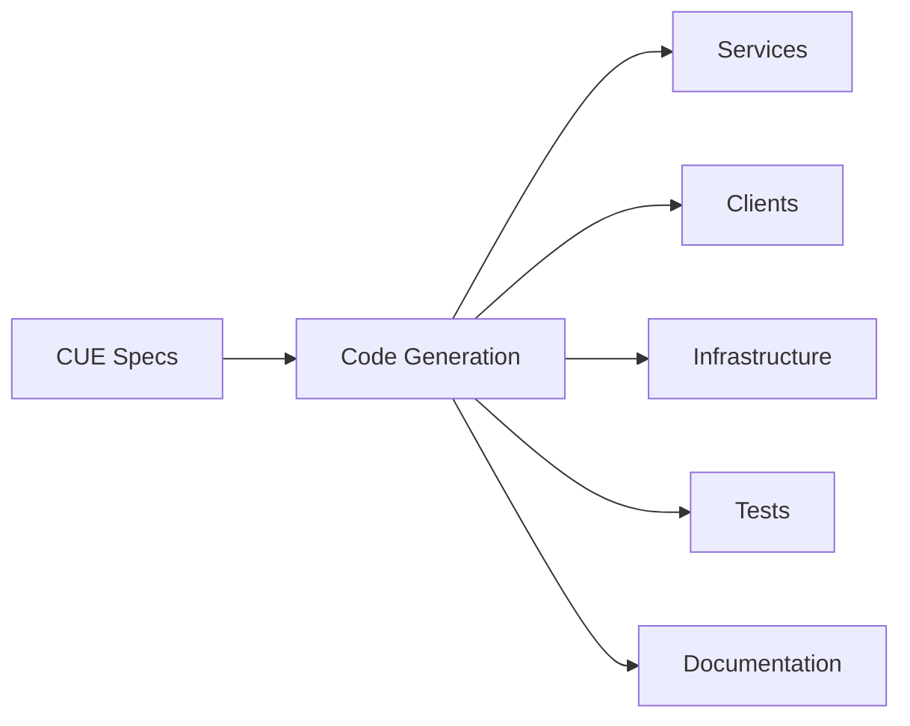

# Arbiter Code Generation System Documentation

Welcome to the comprehensive documentation for Arbiter's code generation system. This collection of guides provides everything you need to understand, configure, and extend Arbiter's powerful code generation capabilities.

## Documentation Overview

This documentation suite covers all aspects of Arbiter's code generation system, from basic usage to advanced customization and extension.

### 📋 Quick Navigation

| Document | Purpose | Audience |
|----------|---------|----------|
| [Architecture Overview](../guides/code-generation-architecture.md) | System design and components | Architects, Senior Developers |
| [Configuration Guide](../guides/code-generation-configuration.md) | Setup and configuration | All Developers |
| [Template Development](../guides/template-development-guide.md) | Creating custom templates | Template Authors |
| [Best Practices](../guides/generation-best-practices.md) | Patterns and guidelines | All Users |
| [API Reference](../reference/api/generation-api-reference.md) | Programmatic interfaces | Plugin Developers |

## Getting Started

### Prerequisites

Before using Arbiter's code generation system, ensure you have:

- **Bun** or **Node.js** runtime
- **CUE CLI** for specification validation
- **Git** for version control
- **Docker** (optional, for containerized generation)

### Quick Start

1. **Install Arbiter CLI**
   ```bash
   bun install -g @arbiter/cli
   # or
   npm install -g @arbiter/cli
   ```

2. **Initialize a new project**
   ```bash
   arbiter init my-app
   cd my-app
   ```

3. **Create a specification**
   ```cue
   // .arbiter/my-app/assembly.cue
   package myapp
   
   {
     product: {
       name: "My Application"
     }
     services: {
       api: {
         language: "typescript"
         ports: [3000]
       }
     }
   }
   ```

4. **Generate code**
   ```bash
   arbiter generate
   ```

That's it! You now have a generated TypeScript service ready for development.

## Core Concepts

### Specification-Driven Development

Arbiter follows a **specification-first** approach where you define your entire application architecture in CUE specifications, then generate all code artifacts from these specifications.



### Multi-Language Support

Generate code for multiple languages and frameworks from a single specification:

- **TypeScript/Node.js** - Express, Next.js, React
- **Python** - FastAPI, Django, Flask
- **Rust** - Axum, Warp, Actix-web
- **Go** - Gin, Echo, Chi
- **Docker** - Containerization and orchestration
- **Kubernetes** - Deployment manifests

### Template-Based Generation

Arbiter uses a flexible template system that supports:

- **Multiple Template Engines** - Handlebars, Liquid, and custom engines
- **Template Inheritance** - Compose templates from reusable components
- **Override Hierarchies** - Customize generation without modifying core templates
- **Rich Context Data** - Comprehensive data extracted from CUE specifications

## Documentation Sections

### 🏗️ [Architecture Overview](../guides/code-generation-architecture.md)

Learn about the internal architecture of Arbiter's code generation system:

- **Generation Pipeline** - The five-phase generation process
- **Core Components** - GenerateService, TemplateRunner, HookExecutor
- **Template System** - Engine interfaces and resolution
- **Language Plugins** - Pluggable code generators
- **Context Providers** - Data extraction and preparation
- **Performance Considerations** - Optimization strategies

**Key Topics:**
- System design principles
- Component interactions
- Data flow through the pipeline
- Extension points and interfaces

### ⚙️ [Configuration Guide](../guides/code-generation-configuration.md)

Comprehensive guide to configuring Arbiter's code generation:

- **Basic Configuration** - Project initialization and options
- **Template Configuration** - Engine setup and aliases
- **Language Plugins** - Per-language configuration
- **Generation Profiles** - Environment-specific settings
- **Override Mechanisms** - Customization strategies
- **Testing Configuration** - Automated test generation

**Key Topics:**
- Configuration file structure
- Command-line options
- Environment-specific profiles
- Template override hierarchies
- Performance tuning

### 🎨 [Template Development Guide](../guides/template-development-guide.md)

Everything you need to create and maintain custom templates:

- **Template Syntax** - Variable interpolation and logic
- **Template Organization** - Directory structure and naming
- **Context Data Reference** - Available data in templates
- **Template Inheritance** - Partials and layouts
- **Testing Templates** - Unit and integration testing
- **Best Practices** - Design patterns and conventions

**Key Topics:**
- Handlebars template syntax
- Context data structure
- Partial and layout systems
- Template testing strategies
- Performance optimization

### 📋 [Best Practices Guide](../guides/generation-best-practices.md)

Patterns, workflows, and guidelines for effective code generation:

- **Development Workflow** - Specification-first development
- **Project Structure** - Organizing generated code
- **Template Design Patterns** - Reusable template strategies
- **Performance Optimization** - Generation and runtime performance
- **Testing Strategies** - Comprehensive testing approaches
- **Security Considerations** - Secure code generation
- **Troubleshooting** - Common issues and solutions

**Key Topics:**
- Iterative development process
- Monorepo organization
- CI/CD integration
- Security best practices
- Performance profiling

### 📖 [API Reference](../reference/api/generation-api-reference.md)

Complete programmatic interface documentation:

- **Core Interfaces** - GenerateOptions, contexts, configurations
- **Generation Service API** - Main generation functions
- **Template System API** - TemplateResolver and engines
- **Language Plugin API** - Plugin development interfaces
- **Hook System API** - Custom generation hooks
- **Utility Functions** - Helper functions and utilities

**Key Topics:**
- TypeScript interfaces
- Function signatures
- Usage examples
- Error handling
- Extension APIs

## Usage Patterns

### Basic Generation

For simple projects, use the standard generation workflow:

```bash
# Validate specification
arbiter check

# Generate code with preview
arbiter generate --dry-run

# Generate code
arbiter generate
```

### Advanced Configuration

For complex projects, leverage advanced configuration:

```json
{
  "generator": {
    "templateOverrides": {
      "typescript": ["./custom-templates"]
    },
    "plugins": {
      "typescript": {
        "framework": "next",
        "testing": "vitest"
      }
    },
    "profiles": {
      "production": {
        "optimization": true,
        "minification": true
      }
    }
  }
}
```

### Custom Templates

Create project-specific templates:

```handlebars
{{!-- custom-templates/typescript/service/main.ts.hbs --}}
/**
 * {{ serviceName }} - Custom Service Template
 */
import express from 'express';

const app = express();
const PORT = {{ port | default 3000 }};

{{#each endpoints}}
app.{{ this.method }}('{{ this.path }}', (req, res) => {
  // Custom implementation for {{ this.description }}
});
{{/each}}

app.listen(PORT);
```

### Programmatic Usage

Use the generation API programmatically:

```typescript
import { generateCommand, GenerateOptions, CLIConfig } from '@arbiter/cli';

const options: GenerateOptions = {
  outputDir: './generated',
  force: true,
  verbose: true
};

const config: CLIConfig = {
  projectDir: process.cwd(),
  generator: {
    plugins: {
      typescript: { framework: 'express' }
    }
  }
};

await generateCommand(options, config);
```

## Integration Examples

### CI/CD Pipeline

```yaml
# .github/workflows/generate.yml
name: Code Generation
on: [push, pull_request]

jobs:
  generate:
    runs-on: ubuntu-latest
    steps:
      - uses: actions/checkout@v3
      - uses: oven-sh/setup-bun@v1
      - name: Install dependencies
        run: bun install
      - name: Validate specifications
        run: arbiter check
      - name: Generate code
        run: arbiter generate --dry-run
```

### Docker Integration

```dockerfile
# Dockerfile.generator
FROM oven/bun:1 AS generator

WORKDIR /app
COPY . .
RUN bun install
RUN arbiter generate

FROM node:18-alpine
WORKDIR /app
COPY --from=generator /app/generated ./
RUN npm install
CMD ["npm", "start"]
```

### Monorepo Setup

```json
{
  "workspaces": ["packages/*"],
  "scripts": {
    "generate": "arbiter generate",
    "build": "bun run generate && bun run build:packages",
    "dev": "concurrently 'arbiter watch' 'bun run dev:packages'"
  }
}
```

## Community and Support

### Contributing

We welcome contributions to improve Arbiter's code generation system:

- **Documentation** - Help improve these guides
- **Templates** - Contribute language-specific templates
- **Language Plugins** - Add support for new languages
- **Bug Reports** - Report issues and edge cases
- **Feature Requests** - Suggest new capabilities

### Resources

- **GitHub Repository**: [arbiter](https://github.com/sibylline-labs/arbiter)
- **Discord Community**: [Join discussions](https://discord.gg/arbiter)
- **Documentation Site**: [docs.arbiter.dev](https://docs.arbiter.dev)
- **Examples Repository**: [arbiter-examples](https://github.com/sibylline-labs/arbiter-examples)

### Getting Help

If you need help with code generation:

1. **Check the documentation** - Start with the relevant guide above
2. **Search existing issues** - Look for similar problems on GitHub
3. **Join the community** - Ask questions on Discord
4. **Create an issue** - Report bugs or request features on GitHub

## Version Compatibility

This documentation covers Arbiter CLI v1.x. For version-specific information:

- **v1.x** - Current stable version with full feature support
- **v0.x** - Legacy version with limited generation capabilities

## License

This documentation and the Arbiter code generation system are licensed under the MIT License. See the LICENSE file for details.

---

**Next Steps:**
- Read the [Architecture Overview](../guides/code-generation-architecture.md) to understand the system design
- Follow the [Configuration Guide](../guides/code-generation-configuration.md) to set up your project
- Explore the [Template Development Guide](../guides/template-development-guide.md) to create custom templates

Happy generating! 🚀