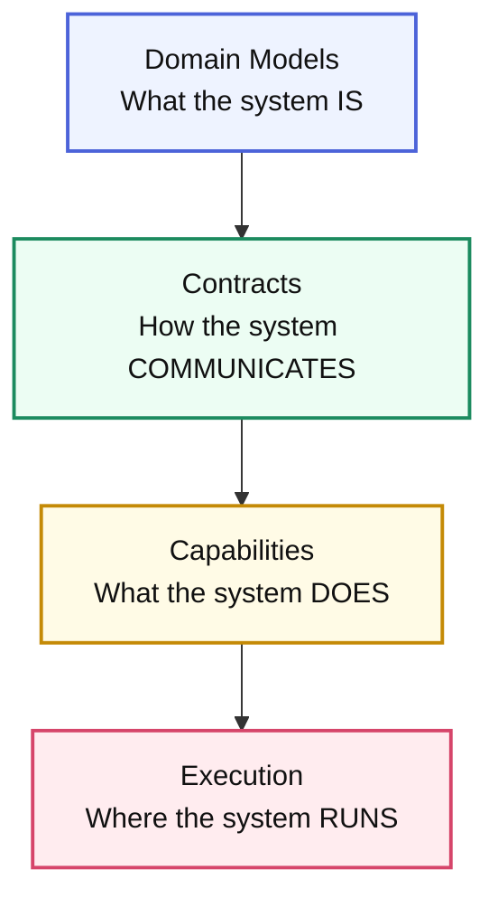

# Core Concepts

**Understanding Arbiter's layered architecture for specification-driven
development**

Arbiter transforms complex system requirements into production-ready
applications through a layered specification architecture. This guide explains
the core concepts that make this transformation possible.

> Looking for hands-on examples? Pair this explainer with the
> [Code Generation Overview](./code-generation-overview.md), which applies the
> same layers step-by-step using the CLI.

## Core Concept Cheat Sheet

| Layer | Primary Question | CLI Kickoff | Deep Dive |
| --- | --- | --- | --- |
| Domain | What does the business care about? | `arbiter add schema`, `arbiter add state-machine` | [Code Generation Overview §1](./code-generation-overview.md#layer-1-%E2%80%94-domain-describe-the-schema) |
| Contracts | How do systems communicate? | `arbiter add contract`, `arbiter add event` | [Section §2](./code-generation-overview.md#layer-2-%E2%80%94-contracts-bind-the-operations) |
| Capabilities | Which services fulfill those contracts? | `arbiter add service`, `arbiter add endpoint` | [Section §3](./code-generation-overview.md#layer-3-%E2%80%94-capabilities-define-the-service) |
| Execution | Where does everything run? | `arbiter add database`, `arbiter add cache` | [Section §4](./code-generation-overview.md#layer-4-%E2%80%94-execution-pin-the-runtime) |

> Already read the CLI walk-through? Treat that overview as the play-by-play. This page keeps the definitions, guardrails, and mental models in one place so you can quickly remind yourself *why* each layer exists.

## The Four-Layer Architecture

Arbiter organizes system specifications into four distinct layers, each building
upon the previous one:



This layered approach ensures that:

- **Changes cascade predictably** from business requirements to deployment
- **Each layer has clear responsibilities** and concerns
- **Generated code maintains consistency** across all components
- **System architecture remains coherent** as it evolves

---

## Layer 1: Domain Models

The **Domain** layer defines the core business concepts and rules that your
system embodies.

### What Goes Here?

- **Schemas**: Core data structures with types (Entity, Value, Request, Response, Event)
  - **Entity schemas**: Business objects with identity (Invoice, Customer, PaymentPlan)
  - **Value schemas**: Immutable data structures (Address, Money, TaxConfig)
  - **Request/Response schemas**: API input/output structures
  - **Event schemas**: Things that happen in your business (InvoiceCreated, PaymentCaptured)
- **State Machines**: Business process flows (InvoiceLifecycle, CollectionsEscalation)
- **Business Rules**: Invariants and constraints that must always hold

### Capturing the Domain

- **Capture vocabulary collaboratively**: run short interviews/whiteboard
  sessions, then encode the nouns and verbs exactly once in the spec.
- **Let the CLI do the formatting**: `arbiter add schema` (with type selection:
  Entity, Value, Request, Response, Event) and `arbiter add state-machine` emit
  valid CUE and keep the structure normalized.
- **Define schemas with CUE syntax**: All schema fields (fields, validation rules,
  relationships) use CUE syntax for type-safe, expressive definitions.
- **Share the output**: `arbiter doc domain` produces a human-friendly glossary
  that product, design, and engineering can reference together.

> Want to see this layer in action? The
> [Code Generation Overview](./code-generation-overview.md#layer-1-%E2%80%94-domain-describe-the-schema)
> walks through the exact CLI flow for the Invoice/Order example.

The result is a **single, enforceable source of truth**—every downstream layer
references these definitions instead of re-implementing validation logic in
code, databases, or docs.

---

## Layer 2: Contracts

The **Contracts** layer defines how different parts of your system communicate
with each other.

### Types of Contracts

Contracts capture the conversation between systems without leaking transport
concerns. Model two complementary shapes:

- **Operation contracts** describe request/response workflows. Services later
  bind them to HTTP, gRPC, queues, etc., by referencing the operation id.
- **Event contracts** capture asynchronous messages—who emits them, who
  subscribes, and what schema guarantees travel with each event.

Author them with the CLI (`arbiter add contract`, `arbiter add contract-operation`,
`arbiter add event`) so identifiers and compatibility metadata stay consistent.

**Contract Definition**: When defining contracts, you specify:
- **Name and SLA/Performance requirements** (upfront for visibility)
- **Version** for compatibility tracking
- **Operations, Request/Response schemas** using CUE syntax in Monaco editors
- **Description** in markdown format

All schema-related fields (operations, requestSchema, responseSchema) use CUE
syntax for type-safe, expressive definitions.

> For the full CLI walkthrough, see the
> [Layer 2 section of the Code Generation Overview](./code-generation-overview.md#layer-2-%E2%80%94-contracts-bind-the-operations).

### Designing Contracts Workflow

1. **Map consumers first**: list every client, service, or partner that touches
   the workflow so you know which guarantees matter.
2. **Capture invariants inline**: assertions, retry budgets, or latency targets
   live next to the contract so generated tests and monitors inherit them.
3. **Promote to transports when ready**: use `arbiter sync --contracts` to emit
   OpenAPI/AsyncAPI or client SDKs after the contract is reviewed.

### Contract Versioning & Compatibility

Arbiter enforces compatibility gates so breaking changes surface early:

```cue
contracts: {
  compat: {
    policy: "strict" | "loose" | "none"
    breakingChangePolicy: "semver" | "explicit-migration"
    deprecationGracePeriod: "30d" | "60d" | "90d"
  }
}
```

- **Strict** demands explicit migrations or version bumps.
- **Loose** tolerates additive changes but still flags removals.
- **None** is reserved for prototypes and should be temporary.

### Gateways, meshes, and chaining

Gateways or service meshes become regular services that forward to canonical
endpoints by setting `handler.type: "endpoint"`. Because handlers point to named
service endpoints, you can compose request flows (edge → mesh → core service)
without duplicating routes. Middleware entries optionally reference existing
modules when you're syncing a brownfield repo; greenfield projects can omit the
paths and let Arbiter place the code automatically.

## Layer 3: Capabilities

The **Capabilities** layer defines what your services actually do and how they
fulfill the contracts.

### Service Definition

Services translate contracts into runnable behavior. Keep them declarative:

- **Describe ownership** with `arbiter add service <name>`—language, template,
  and source directory live alongside metadata (`type`, `workload`, dependencies).
- **Declare endpoints** via `arbiter add endpoint ... --service <name>` so each
  route points back to a contract operation and optional middleware chain.
- **Reference existing code sparingly**: handler/middleware `module` paths are
  optional overrides for brownfield repos. Greenfield specs let Arbiter place
  files automatically.

> Need a detailed example? Jump to
> [Layer 3 in the Code Generation Overview](./code-generation-overview.md#layer-3-%E2%80%94-capabilities-define-the-service).

**Service source hints**

- `type: "internal"` pairs with `source.package`/`source.directory` so Arbiter
  owns the implementation.
- `type: "external"` documents SaaS/managed services via `source.url` or custom
  metadata so generated docs/tests know about dependencies.
- Use `dependencies` and `resource` blocks to describe upstream databases,
  caches, or third-party APIs.

_Only include handler or middleware `module` paths when anchoring the spec to
existing code (brownfield imports or post-generation sync)._ Otherwise leave
them undefined so Arbiter infers the correct location from the project
structure.

> **Brownfield override only**  
> The `handler.module` and `middleware[].module` fields keep the spec in sync with repositories that already have hand-written code. New services should leave those paths blank and let the generator derive the location from `ProjectStructureConfig`. That keeps the spec portable while still letting you pin exact files when you need to.

### Capability Types
### Capability Types

Arbiter supports various service capability patterns:

- **HTTP Server**: REST APIs, GraphQL endpoints
- **Event Consumer**: Message queue subscribers, event handlers
- **Event Publisher**: Message producers, event emitters
- **Scheduler**: Cron jobs, recurring tasks
- **Worker**: Background job processors
- **CLI**: Command-line interfaces
- **Batch Processor**: Data processing pipelines

### Workshop: Apply the Capabilities Layer

1. **Assign ownership** by linking each capability to the entities/contracts it stewards (InvoiceService owns Invoice + InvoiceAPI).
2. **Prototype execution hooks** (schedulers, consumers, workers) directly in CUE so the CLI scaffolds runnable services with identical wiring.
3. **Keep runtime hints close**: languages, frameworks, and datastore affinities live here so generation produces stack-specific code without manual tweaking.
4. **Chain behaviors explicitly**: gateways, meshes, and background workers can set `handler.type: "endpoint"` to call downstream endpoints, layering middleware at each hop (rewrite headers, mask PII, enforce auth).

Try `arbiter generate service InvoiceService` to emit a Fastify skeleton plus docs/tests that mirror the spec.

---

## Layer 4: Execution

The **Execution** layer specifies where and how your services run in production.

### Environment-Scoped Environments

- **Describe environments declaratively**: `environments.development`,
  `environments.production`, etc., capture targets (Compose, Kubernetes,
  serverless) and per-service overrides (replicas, env vars, resources).
- **Model shared infrastructure as services** by setting `type: "external"` and
  attaching `resource` metadata (database/cache/queue). Dependencies then point
  to the service name instead of hard-coded URLs.
- **Keep overrides co-located**: scaling hints, feature flags, and ingress traits
  belong beside the service entry so generated Terraform/Helm/Docker assets stay
  in sync.
- **Use the CLI**: `arbiter add database`, `arbiter add cache`, and
  `arbiter sync` manage the structure without manual YAML edits.

> For a full manifest example, see
> [Layer 4 in the Code Generation Overview](./code-generation-overview.md#layer-4-%E2%80%94-execution-generate-and-run).

### Workshop: Apply the Execution Layer

1. **Pick deployment targets per environment** (`development` → Compose,
   `production` → Kubernetes) and describe cluster/compose options inline.
2. **Describe shared resources as services** with `type: "external" + resource`
   metadata so dependencies remain explicit.
3. **Attach overrides per environment** (replicas, env vars, annotations) in
   `environments.<env>.services` instead of scattering them through manifests.
4. **Promote the plan** using `arbiter generate` to emit
   Terraform/Helm/Compose manifests that inherit those exact constraints.

## Guided Walkthrough: From Idea to Running Service

1. **Capture intent** – extend the Domain layer with the next InvoicePro concept (for example, `UsageBasedBilling`) and its events in one PR.
2. **Expose collaboration points** – add HTTP/event contracts that describe how finance, collections, and analytics teams consume the billing data.
3. **Define execution ownership** – introduce a `BillingService` capability, wire it to contracts, declare its dependencies (databases, caches) as services, and describe the env-specific overrides in `environments`.
4. **Generate and review** – run `arbiter generate --dry-run` to see code, docs, and deployment manifests that all reflect the spec, then merge when stakeholders sign off.

Following this loop turns the layered model into a tutorial every new InvoicePro product slice can follow.

---

## Key Benefits of This Architecture

### 1. **Deterministic Generation**

The same specification always produces identical code, deployment manifests, and
configuration files.

### 2. **Change Impact Analysis**

Modifications to any layer automatically propagate to dependent layers, making
impact analysis automatic.

### 3. **Evolution Safety**

Breaking changes are detected and require explicit migrations or version bumps.

### 4. **Technology Agnostic**

The specification is independent of specific frameworks, databases, or cloud
providers.

### 5. **AI-Friendly**

The structured, declarative format is ideal for AI agents to understand and
modify.

---

## Working with Specifications

### Creating a New Specification

1. **Start with Domain**: Define your core business entities and rules
2. **Add Contracts**: Specify how systems will communicate
3. **Define Capabilities**: Declare what services will do
4. **Configure Execution**: Specify environments, environment overrides, and service dependencies

### Iterative Development

Let the CLI mutate the spec so identifiers, metadata, and docs stay in sync. Drop to a text editor only when reconciling brownfield repos or performing bulk refactors that the CLI does not yet support.

```bash
# Apply spec changes via the CLI (preferred)
arbiter add service InvoiceService --template fastify
arbiter add endpoint InvoiceService --service InvoiceService --path /api/invoices/{invoiceId}

# Only edit the CUE directly when reconciling brownfield changes
# vim .arbiter/assembly.cue

# Validate changes
arbiter check

# Preview what will be generated
arbiter generate --dry-run

# Generate the code
arbiter generate

# Test the generated system
arbiter integrate --test
```

> **CLI first.** Use the `arbiter add|remove|rename` workflows to evolve the spec. Manual edits should be rare and limited to advanced migrations or brownfield imports.

### Version Management

Arbiter tracks specification versions and enforces compatibility:

```cue
meta: {
  version: "1.2.0"
  previous: "1.1.0"
}

codegen: {
  profile: "production-ready"
  templateHash: "abc123def456"
  compatibility: {
    checkBreakingChanges: true
    requireMigrations: true
  }
}
```

---

## Best Practices

### Model the Spec In Layers

- **Domain First**: capture vocabulary, invariants, and workflows before worrying
  about runtime. Use the unified Schema concept with appropriate types (Entity,
  Value, Request, Response, Event) rather than treating entities and value objects
  as separate constructs. If it isn't in the domain layer, downstream automation
  can't reuse it.
- **Contracts Next**: describe how work flows across the system (operations,
  events, assertions) while staying transport-agnostic. Version the contract and
  document intent inline so future PRs have context. Prioritize SLA/Performance
  requirements upfront for visibility.
- **Capabilities & Services**: bind domain + contracts to implementation details
  (languages, frameworks, endpoints). Keep the spec honest by referencing real
  modules/paths rather than prose.

### Keep Implementations Adaptable

- **Start Stateful in the Spec, Not the Runtime**: express dependencies,
  configs, and service source locations declaratively so you can change the
  actual architecture later without rewriting your spec.
- **Model Environments Explicitly**: use `environments.<env>` to describe how
  each environment overrides replicas, env vars, or ingress. Keeping this in the
  spec prevents drift between dev/stage/prod.
- **Document External Touchpoints**: when referencing APIs, SaaS systems, or
  managed databases, record the canonical URL or contract name in `source`/
  `dependencies` so codegen and tests know who you depend on.

---

## Next Steps

- **[CLI Reference](../reference/cli-reference.md)** - Learn all Arbiter commands
- **[Kubernetes Tutorial](../tutorials/kubernetes/README.md)** - Deploy to
  Kubernetes
- **[Examples](../tutorials/basics/Readme.md)** - Explore real-world specifications
- **[API Documentation](../reference/api/generation-api-reference.md)** - Understand the generated APIs

---

_The four-layer architecture provides a systematic way to think about and build
complex systems. By separating concerns clearly, Arbiter ensures that your
specifications remain maintainable and your generated systems stay consistent as
they evolve._
