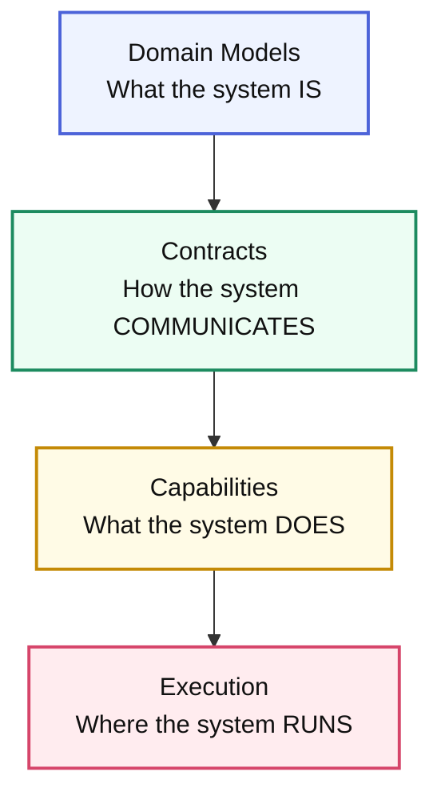

# Core Concepts

**Understanding Arbiter's layered architecture for specification-driven
development**

Arbiter transforms complex system requirements into production-ready
applications through a layered specification architecture. This guide explains
the core concepts that make this transformation possible.

## The Four-Layer Architecture

Arbiter organizes system specifications into four distinct layers, each building
upon the previous one:



This layered approach ensures that:

- **Changes cascade predictably** from business requirements to deployment
- **Each layer has clear responsibilities** and concerns
- **Generated code maintains consistency** across all components
- **System architecture remains coherent** as it evolves

---

## Layer 1: Domain Models

The **Domain** layer defines the core business concepts and rules that your
system embodies.

### What Goes Here?

- **Entities**: Core business objects with identity (User, Order, Product)
- **Value Objects**: Immutable data structures (Address, Money, Email)
- **Domain Events**: Things that happen in your business (OrderPlaced,
  UserRegistered)
- **State Machines**: Business process flows (OrderProcessing, UserOnboarding)
- **Business Rules**: Invariants and constraints that must always hold

### Example Domain Specification

```cue
domain: {
  entities: {
    User: {
      id: string & =~"^usr_[a-z0-9]+$"
      email: string & =~"^[a-zA-Z0-9._%+-]+@[a-zA-Z0-9.-]+\\.[a-zA-Z]{2,}$"
      profile: UserProfile
      createdAt: string // ISO datetime
      status: "active" | "suspended" | "pending"
    }

    Order: {
      id: string & =~"^ord_[a-z0-9]+$"
      userId: User.id
      items: [...OrderItem]
      total: decimal & >=0
      status: "pending" | "confirmed" | "shipped" | "delivered"
    }
  }

  stateMachines: {
    OrderLifecycle: {
      initial: "pending"
      states: {
        pending: { on: { confirm: "confirmed", cancel: "cancelled" } }
        confirmed: { on: { ship: "shipped", cancel: "cancelled" } }
        shipped: { on: { deliver: "delivered" } }
        delivered: {}
        cancelled: {}
      }
    }
  }
}
```

### Workshop: Apply the Domain Layer

1. **Interview subject-matter experts** and sketch the vocabulary they already use (entities, lifecycle states, critical events).
2. **Translate the language into CUE** by encoding value objects first, then identities and events so constraints stay centralized.
3. **Model signature workflows** (onboarding, refunds, SLAs) as state machines so you can prove coverage without shipping code.

Export samples with `arbiter doc domain.cue` and circulate them like a living glossary—everyone downstream will reuse the same types.

### Why This Matters

The Domain layer serves as the **single source of truth** for your business
logic. Unlike traditional approaches where business rules are scattered across
database schemas, API models, and UI components, Arbiter ensures that your
domain model drives everything else.

---

## Layer 2: Contracts

The **Contracts** layer defines how different parts of your system communicate
with each other.

### Types of Contracts

#### HTTP APIs

RESTful or RPC-style HTTP interfaces:

```cue
contracts: {
  http: {
    UserAPI: {
      version: "v1"
      baseUrl: "/api/v1/users"
      endpoints: {
        createUser: {
          method: "POST"
          path: "/"
          request: domain.entities.User
          response: {
            user: domain.entities.User
            token: string
          }
          assertions: {
            tokenIssued: {
              assert: response.token != ""
              message: "Token should be returned for new users"
            }
          }
        }
        getUser: {
          method: "GET"
          path: "/{userId}"
          parameters: { userId: domain.entities.User.id }
          response: domain.entities.User
          assertions: {
            userExists: response.id != ""
          }
        }
      }
    }
}
}
```

### Workshop: Apply the Contracts Layer

1. **Map domain events to consumers**—who needs to read or mutate each entity?
2. **Capture expectations inline** (assertions, latency requirements, authentication hints) so automated tests and monitors inherit them.
3. **Promote contracts into generated artifacts** using `arbiter sync --contracts` to keep OpenAPI/AsyncAPI, SDKs, and docs synchronized.

When you promote a contract into the application specification you can describe
the concrete HTTP behaviour using the `paths` section, which now maps cleanly to
OpenAPI:

```cue
paths: {
  "/api/v1/users/{userId}": {
    get: {
      summary: "Fetch a user by ID"
      operationId: "getUserById"
      tags: ["users"]
      parameters: [{
        name:        "userId"
        "in":        "path"
        description: "Identifier of the user"
        required:    true
        schema:      { type: "string" }
      }]
      responses: {
        "200": {
          description: "User payload"
          content: {
            "application/json": {
              schemaRef: "#/components/schemas/User"
            }
          }
        }
      }
    }
  }
}
```

#### Event Contracts

Asynchronous communication patterns:

```cue
contracts: {
  events: {
    OrderEvents: {
      version: "v1"
      events: {
        OrderPlaced: {
          schema: {
            orderId: domain.entities.Order.id
            userId: domain.entities.User.id
            timestamp: string
            total: decimal
          }
        }
        OrderShipped: {
          schema: {
            orderId: domain.entities.Order.id
            trackingNumber: string
            carrier: string
          }
        }
      }
    }
  }
}
```

### Contract Versioning & Compatibility

Arbiter enforces contract compatibility to prevent breaking changes:

```cue
contracts: {
  compat: {
    policy: "strict" | "loose" | "none"
    breakingChangePolicy: "semver" | "explicit-migration"
    deprecationGracePeriod: "30d" | "60d" | "90d"
  }
}
```

---

## Layer 3: Capabilities

The **Capabilities** layer defines what your services actually do and how they
fulfill the contracts.

### Service Definition

```cue
services: {
  UserService: {
    // What domain entities this service owns
    owns: ["User", "UserProfile"]

    // What contracts this service implements
    implements: ["UserAPI"]

    // What events this service publishes
    publishes: ["UserCreated", "UserUpdated"]

    // What events this service subscribes to
    subscribes: ["OrderPlaced"] // Maybe to update user stats

    // Service capabilities
    capabilities: {
      httpServer: {
        port: 3000
        routes: contracts.http.UserAPI
      }

      eventConsumer: {
        topics: ["orders"]
      }

      scheduler: {
        jobs: {
          cleanupInactiveUsers: {
            schedule: "0 2 * * *" // Daily at 2 AM
            handler: "cleanupUsers"
          }
        }
      }
    }

    // Runtime configuration
    runtime: {
      language: "typescript"
      framework: "fastify"
      database: "postgresql"
    }
  }
}
```

### Capability Types

Arbiter supports various service capability patterns:

- **HTTP Server**: REST APIs, GraphQL endpoints
- **Event Consumer**: Message queue subscribers, event handlers
- **Event Publisher**: Message producers, event emitters
- **Scheduler**: Cron jobs, recurring tasks
- **Worker**: Background job processors
- **CLI**: Command-line interfaces
- **Batch Processor**: Data processing pipelines

### Workshop: Apply the Capabilities Layer

1. **Assign ownership** by linking each capability to the domain entities/contracts it stewards—now on-call charts draw themselves.
2. **Prototype execution hooks** (schedulers, consumers, workers) directly in CUE so the CLI can scaffold runnable services with the same wiring.
3. **Keep runtime hints close**: languages, frameworks, and datastore affinities live here so generation produces stack-specific code without manual tweaking.

Try `arbiter generate service UserService` to emit a Fastify skeleton plus docs/tests that mirror the spec.

---

## Layer 4: Execution

The **Execution** layer specifies where and how your services run in production.

### Deployment Configuration

```cue
deployment: {
  target: "kubernetes" | "docker-compose" | "serverless" | "bare-metal"

  environments: {
    development: {
      replicas: 1
      resources: {
        cpu: "100m"
        memory: "256Mi"
      }
    }

    production: {
      replicas: 3
      resources: {
        cpu: "500m"
        memory: "1Gi"
      }
      autoscaling: {
        minReplicas: 2
        maxReplicas: 10
        targetCPU: 70
      }
    }
  }
}
```

### Infrastructure Resources

```cue
infrastructure: {
  databases: {
    mainDB: {
      engine: "postgresql"
      version: "15"
      size: "small"
      backup: { retention: "7d", schedule: "0 1 * * *" }
    }
  }

  caches: {
    sessionCache: {
      engine: "redis"
      version: "7"
      size: "micro"
    }
  }

  messageQueues: {
    eventBus: {
      engine: "kafka"
      topics: ["orders", "users", "notifications"]
      partitions: 3
      retention: "168h"
    }
  }
}
```

### Workshop: Apply the Execution Layer

1. **Pick deployment targets** per capability (Kubernetes, serverless, ECS) and encode availability/SLO assumptions in the `environments` block.
2. **Reference shared resources** (databases, caches, queues) by logical name so generated IaC and service configs stay aligned.
3. **Promote the plan** using `arbiter generate infrastructure` to emit Terraform/Helm manifests that inherit the exact same constraints.

## Guided Walkthrough: From Idea to Running Service

1. **Capture intent** – extend the Domain layer with the new concept (for example, `UsageBasedBilling`) and its events in one PR.
2. **Expose collaboration points** – add HTTP/event contracts that describe how other teams or automation consume the billing data.
3. **Define execution ownership** – introduce a `BillingService` capability, wire it to contracts, and specify infra (database tier, queue topic, autoscaling).
4. **Generate and review** – run `arbiter generate --dry-run` to see code, docs, and deployment manifests that all reflect the spec, then merge when stakeholders sign off.

Following this loop turns the layered model into a tutorial you can repeat for each new product slice.

---

## Key Benefits of This Architecture

### 1. **Deterministic Generation**

The same specification always produces identical code, infrastructure, and
configuration files.

### 2. **Change Impact Analysis**

Modifications to any layer automatically propagate to dependent layers, making
impact analysis automatic.

### 3. **Evolution Safety**

Breaking changes are detected and require explicit migrations or version bumps.

### 4. **Technology Agnostic**

The specification is independent of specific frameworks, databases, or cloud
providers.

### 5. **AI-Friendly**

The structured, declarative format is ideal for AI agents to understand and
modify.

---

## Working with Specifications

### Creating a New Specification

1. **Start with Domain**: Define your core business entities and rules
2. **Add Contracts**: Specify how systems will communicate
3. **Define Capabilities**: Declare what services will do
4. **Configure Execution**: Specify deployment and infrastructure

### Iterative Development

```bash
# Edit your specification
vim arbiter.assembly.cue

# Validate changes
arbiter check

# Preview what will be generated
arbiter generate --dry-run

# Generate the code
arbiter generate

# Test the generated system
arbiter integrate --test
```

### Version Management

Arbiter tracks specification versions and enforces compatibility:

```cue
meta: {
  version: "1.2.0"
  previous: "1.1.0"
}

codegen: {
  profile: "production-ready"
  templateHash: "abc123def456"
  compatibility: {
    checkBreakingChanges: true
    requireMigrations: true
  }
}
```

---

## Best Practices

### Domain Modeling

- **Start Simple**: Begin with core entities, add complexity gradually
- **Business-First**: Model what your business does, not how software works
- **Immutable Events**: Domain events should be immutable historical facts
- **Clear Boundaries**: Each service should own a cohesive set of domain
  concepts

### Contract Design

- **Version Everything**: Always include explicit versions in contracts
- **Backwards Compatible**: Design for evolution without breaking existing
  clients
- **Explicit Schemas**: Don't rely on implicit or inferred data structures
- **Document Intent**: Include business context in contract descriptions

### Service Architecture

- **Single Responsibility**: Each service should have a clear, focused purpose
- **Domain Alignment**: Service boundaries should match domain boundaries
- **Event-Driven**: Prefer async communication through events over direct calls
- **Stateless Logic**: Keep business logic stateless and data separate

### Deployment Strategy

- **Environment Parity**: Keep development, staging, and production similar
- **Gradual Rollout**: Design for blue-green or canary deployments
- **Observable**: Include metrics, logging, and health checks from the start
- **Recoverable**: Plan for failures and include rollback strategies

---

## Next Steps

- **[CLI Reference](../reference/cli-reference.md)** - Learn all Arbiter commands
- **[Kubernetes Tutorial](../tutorials/kubernetes/README.md)** - Deploy to
  Kubernetes
- **[Examples](../tutorials/basics/Readme.md)** - Explore real-world specifications
- **[API Documentation](../reference/api/generation-api-reference.md)** - Understand the generated APIs

---

_The four-layer architecture provides a systematic way to think about and build
complex systems. By separating concerns clearly, Arbiter ensures that your
specifications remain maintainable and your generated systems stay consistent as
they evolve._
