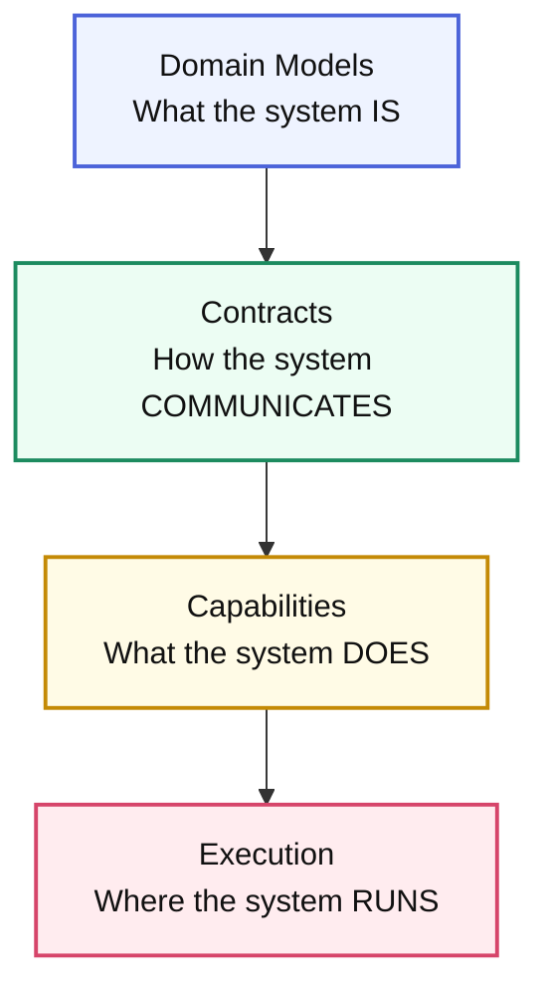

# Core Concepts

**Understanding Arbiter's layered architecture for specification-driven
development**

Arbiter transforms complex system requirements into production-ready
applications through a layered specification architecture. This guide explains
the core concepts that make this transformation possible.

## The Four-Layer Architecture

Arbiter organizes system specifications into four distinct layers, each building
upon the previous one:



This layered approach ensures that:

- **Changes cascade predictably** from business requirements to deployment
- **Each layer has clear responsibilities** and concerns
- **Generated code maintains consistency** across all components
- **System architecture remains coherent** as it evolves

---

## Layer 1: Domain Models

The **Domain** layer defines the core business concepts and rules that your
system embodies.

### What Goes Here?

- **Entities**: Core business objects with identity (Invoice, Customer, PaymentPlan)
- **Value Objects**: Immutable data structures (Address, Money, TaxConfig)
- **Domain Events**: Things that happen in your business (InvoiceCreated,
  PaymentCaptured)
- **State Machines**: Business process flows (InvoiceLifecycle, CollectionsEscalation)
- **Business Rules**: Invariants and constraints that must always hold

### Example Domain Specification

```cue
// InvoicePro domain extract (CUE)
domain: {
  entities: {
    Invoice: {
      id: string & =~"^inv_[a-z0-9]+$"
      customerId: Customer.id
      status: "draft" | "pending" | "sent" | "viewed" | "paid" | "overdue"
      currency: "USD" | "EUR" | "GBP"
      total: decimal & >=0
      dueDate: string // ISO datetime
    }

    Customer: {
      id: string & =~"^cust_[a-z0-9]+$"
      name: string
      email: string & =~"^[^@]+@[^@]+$"
      collectionStrategy: "standard" | "proactive"
    }
  }

  stateMachines: {
    InvoiceLifecycle: {
      initial: "draft"
      states: {
        draft: { on: { approve: "pending" } }
        pending: { on: { send: "sent", void: "voided" } }
        sent: { on: { viewed: "viewed", pay: "paid", expire: "overdue" } }
        viewed: { on: { pay: "paid", escalate: "overdue" } }
        paid: {}
        overdue: {}
        voided: {}
      }
    }
  }
}
```

### Workshop: Apply the Domain Layer

1. **Interview subject-matter experts** and sketch the vocabulary they already use (for InvoicePro that meant “invoice,” “customer,” and “collections escalation”).
2. **Translate the language into CUE** by encoding value objects first, then identities and events so constraints stay centralized.
3. **Model signature workflows** (invoice lifecycle, collections escalation, payment retries) as state machines so you can prove coverage without shipping code.

Export samples with `arbiter doc domain.cue` and circulate them like a living glossary—everyone downstream will reuse the same types.

### Why This Matters

The Domain layer serves as the **single source of truth** for your business
logic. Unlike traditional approaches where business rules are scattered across
database schemas, API models, and UI components, Arbiter ensures that your
domain model drives everything else.

---

## Layer 2: Contracts

The **Contracts** layer defines how different parts of your system communicate
with each other.

### Types of Contracts

#### Operation contracts (transport agnostic)

Contracts should describe pure behavior—what data goes in and what comes out—
without assuming HTTP, gRPC, queues, etc. Transports are attached later when a
service endpoint implements the contract.

```cue
contracts: {
  workflows: {
    InvoiceAPI: {
      version: "2024-12-26"
      operations: {
        createInvoice: {
          input: { invoice: domain.entities.Invoice }
          output: { invoice: domain.entities.Invoice, warnings?: [...string] }
          assertions: [
            { assert: input.invoice.total > 0, message: "Invoice total must be positive" }
          ]
        }
        getInvoice: {
          input: { invoiceId: domain.entities.Invoice.id }
          output: { invoice: domain.entities.Invoice }
          errors?: [{ name: "InvoiceNotFound", when: "invoice missing" }]
        }
      }
    }
  }
}
```

### Workshop: Apply the Contracts Layer

1. **Map operations to consumers**—for InvoicePro that means payments, collections, analytics, and support.
2. **Capture expectations inline** (assertions, latency requirements, retries) so automated tests and monitors inherit them.
3. **Promote contracts into generated artifacts** using `arbiter sync --contracts` to keep OpenAPI/AsyncAPI, SDKs, and docs synchronized once a transport is attached.

Operations stay transport agnostic. Service endpoints then bind them to HTTP,
gRPC, queues, etc., by referencing the operation when generating routes.

#### Event Contracts

Asynchronous communication patterns:

```cue
contracts: {
  events: {
    PaymentEvents: {
      version: "2024-12-26"
      events: {
        InvoiceViewed: {
          schema: {
            invoiceId: domain.entities.Invoice.id
            viewerId: domain.entities.Customer.id
            viewedAt: string
          }
        }
        PaymentCaptured: {
          schema: {
            invoiceId: domain.entities.Invoice.id
            amount: domain.entities.Invoice.total
            method: "CARD" | "ACH" | "WIRE"
            capturedAt: string
          }
        }
      }
    }
  }
}
```

### Contract Versioning & Compatibility

Arbiter enforces contract compatibility to prevent breaking changes:

```cue
contracts: {
  compat: {
    policy: "strict" | "loose" | "none"
    breakingChangePolicy: "semver" | "explicit-migration"
    deprecationGracePeriod: "30d" | "60d" | "90d"
  }
}
```

### Explicit gateway + mesh services (Envoy/Traefik/etc.)

Contracts describe behavior, but the **service** layer owns the canonical
endpoints. Any gateway/mesh you expose (Envoy, Traefik, API Gateway) is simply
another service that forwards to those endpoints by setting
`handler.type: "endpoint"`. Because handlers point to named service endpoints,
you can build chains (service → mesh → edge) and layer middleware or transforms
at every hop without duplicating paths.

```cue
services: {
  InvoiceService: {
    type: "internal"
    source: { package: "./services/invoice" }
    endpoints: {
      getInvoice: {
        path: "/internal/invoices/{invoiceId}"
        methods: ["GET","HEAD"]
        handler: {
          type: "module"
          module: "./services/invoice/http/get-invoice.ts"
          function: "handler"
        }
        implements: "contracts.workflows.InvoiceAPI.operations.getInvoice"
        middleware: [{
          module: "./services/invoice/middleware/audit.ts"
          function: "recordAccess"
        }]
      }
    }
  }

  BillingGateway: {
    type: "internal"
    source: { package: "./services/gateway" }
    endpoints: {
      invoicePublic: {
        path: "/api/invoices/{invoiceId}"
        methods: ["GET"]
        handler: {
          type: "endpoint"
          service: "InvoiceService"
          endpoint: "getInvoice"
        }
        implements: "contracts.workflows.InvoiceAPI.operations.getInvoice"
        middleware: [{
          module: "./services/gateway/middleware/auth.ts"
          function: "requireCustomerAuth"
          phase: "request"
        }, {
          module: "./services/gateway/middleware/mask.ts"
          function: "maskPII"
          phase: "response"
        }]
      }
    }
  }
}
```

- **InvoiceService** defines the canonical path/method pairing so Arbiter can
  scaffold controllers, smoke tests, and deployment wiring exactly once.
- **BillingGateway** is just another service. Because its handler references
  `InvoiceService.getInvoice`, referential integrity stays explicit and you can
  daisy-chain as many hops (mesh, ingress, partner edge) as you need.
- **Middleware entries** point to real modules/functions, so you reuse the same
  building blocks everywhere—auth, logging, transforms, masking, etc.
- **Chains of handlers** are encouraged: a gateway can forward to another
  gateway or service, layering middleware and even transformations before the
  request ever reaches code generation, instead of copying routes in multiple
  places.

This pattern keeps URLs coupled to the services where real code lives while
still allowing multiple exposure layers for public, partner, or internal users.

---

## Layer 3: Capabilities

The **Capabilities** layer defines what your services actually do and how they
fulfill the contracts.

### Service Definition

```cue
services: {
  InvoiceService: {
    endpoints: {
      getInvoice: {
        path: "/internal/invoices/{invoiceId}"
        methods: ["GET","HEAD"]
        handler: {
          type: "module"
          module: "./services/invoice/http/get-invoice.ts"
          function: "handler"
        }
        implements: "contracts.workflows.InvoiceAPI.operations.getInvoice"
        middleware: [{
          module: "./services/invoice/middleware/audit.ts"
          function: "recordAccess"
        }]
      }
    }
  }

  BillingGateway: {
    endpoints: {
      invoicePublic: {
        path: "/api/invoices/{invoiceId}"
        methods: ["GET"]
        handler: {
          type: "endpoint"
          service: "InvoiceService"
          endpoint: "getInvoice"
        }
        implements: "contracts.workflows.InvoiceAPI.operations.getInvoice"
        middleware: [{
          module: "./services/gateway/middleware/auth.ts"
          function: "requireCustomerAuth"
        }]
      }
    }
  }
}
```

**Service source hints**

- Set `type: "internal"` when Arbiter owns the code. Pair it with `source`
  describing where the code lives—`{ package: "./services/invoice" }` for a repo
  path or `{ dockerfile: "./services/invoice/Dockerfile" }` when you publish an
  image from a specific build context.
- Use `type: "external"` for SaaS/managed services and set `source`
  to the canonical endpoint (for example `{ url: "https://payments.acme.com" }`)
  so documentation/tests still know where to reach the dependency.

### Capability Types

Arbiter supports various service capability patterns:

- **HTTP Server**: REST APIs, GraphQL endpoints
- **Event Consumer**: Message queue subscribers, event handlers
- **Event Publisher**: Message producers, event emitters
- **Scheduler**: Cron jobs, recurring tasks
- **Worker**: Background job processors
- **CLI**: Command-line interfaces
- **Batch Processor**: Data processing pipelines

### Workshop: Apply the Capabilities Layer

1. **Assign ownership** by linking each capability to the entities/contracts it stewards (InvoiceService owns Invoice + InvoiceAPI).
2. **Prototype execution hooks** (schedulers, consumers, workers) directly in CUE so the CLI scaffolds runnable services with identical wiring.
3. **Keep runtime hints close**: languages, frameworks, and datastore affinities live here so generation produces stack-specific code without manual tweaking.
4. **Chain behaviors explicitly**: gateways, meshes, and background workers can set `handler.type: "endpoint"` to call downstream endpoints, layering middleware at each hop (rewrite headers, mask PII, enforce auth).

Try `arbiter generate service InvoiceService` to emit a Fastify skeleton plus docs/tests that mirror the spec.

---

## Layer 4: Execution

The **Execution** layer specifies where and how your services run in production.

### Environment-Scoped Deployments

```cue
deployments: {
  development: {
    target: "compose"
    compose: { version: "3.9" }
    services: {
      InvoiceService: {
        env: { DATABASE_URL: "postgres://postgres:postgres@db:5432/invoices" }
      }
    }
  }

  production: {
    target: "kubernetes"
    cluster: { name: "prod", provider: "gke", namespace: "invoice-system" }
    services: {
      InvoiceService: {
        replicas: 4
        resources: {
          requests: { cpu: "250m", memory: "512Mi" }
          limits: { cpu: "750m", memory: "1Gi" }
        }
      }
      InvoiceDatabase: {
        annotations: { "backup.policy": "gold" }
      }
    }
  }
}

deployment: deployments.production // backward-compatible default
```

### Model External Platforms as Services

```cue
services: {
  InvoiceDatabase: {
    type: "external"
    resource: { kind: "database", engine: "postgres" }
    source: { url: "postgres://invoice-db.internal.svc.cluster.local:5432/invoices" }
  }

  InvoiceService: {
    type: "internal"
    source: { package: "./services/invoice" }
    dependencies: {
      db: {
        service: "InvoiceDatabase"
        version: ">=15"
        kind: "postgres"
      }
    }
  }
}
```

### Workshop: Apply the Execution Layer

1. **Pick deployment targets per environment** (`development` → Compose, `production` → Kubernetes) and describe cluster/compose options inline.
2. **Describe shared resources as services** with `type: "external"` + `resource` metadata so dependencies remain explicit.
3. **Attach overrides per environment** (replicas, env vars, annotations) in `deployments.<env>.services` instead of scattering them through manifests.
4. **Promote the plan** using `arbiter generate infrastructure` to emit Terraform/Helm/Compose manifests that inherit those exact constraints.

## Guided Walkthrough: From Idea to Running Service

1. **Capture intent** – extend the Domain layer with the next InvoicePro concept (for example, `UsageBasedBilling`) and its events in one PR.
2. **Expose collaboration points** – add HTTP/event contracts that describe how finance, collections, and analytics teams consume the billing data.
3. **Define execution ownership** – introduce a `BillingService` capability, wire it to contracts, declare its dependencies (databases, caches) as services, and describe the env-specific overrides in `deployments`.
4. **Generate and review** – run `arbiter generate --dry-run` to see code, docs, and deployment manifests that all reflect the spec, then merge when stakeholders sign off.

Following this loop turns the layered model into a tutorial every new InvoicePro product slice can follow.

---

## Key Benefits of This Architecture

### 1. **Deterministic Generation**

The same specification always produces identical code, deployment manifests, and
configuration files.

### 2. **Change Impact Analysis**

Modifications to any layer automatically propagate to dependent layers, making
impact analysis automatic.

### 3. **Evolution Safety**

Breaking changes are detected and require explicit migrations or version bumps.

### 4. **Technology Agnostic**

The specification is independent of specific frameworks, databases, or cloud
providers.

### 5. **AI-Friendly**

The structured, declarative format is ideal for AI agents to understand and
modify.

---

## Working with Specifications

### Creating a New Specification

1. **Start with Domain**: Define your core business entities and rules
2. **Add Contracts**: Specify how systems will communicate
3. **Define Capabilities**: Declare what services will do
4. **Configure Execution**: Specify deployments, environment overrides, and service dependencies

### Iterative Development

```bash
# Edit your specification
vim arbiter.assembly.cue

# Validate changes
arbiter check

# Preview what will be generated
arbiter generate --dry-run

# Generate the code
arbiter generate

# Test the generated system
arbiter integrate --test
```

### Version Management

Arbiter tracks specification versions and enforces compatibility:

```cue
meta: {
  version: "1.2.0"
  previous: "1.1.0"
}

codegen: {
  profile: "production-ready"
  templateHash: "abc123def456"
  compatibility: {
    checkBreakingChanges: true
    requireMigrations: true
  }
}
```

---

## Best Practices

### Model the Spec In Layers

- **Domain First**: capture vocabulary, invariants, and workflows before worrying
  about runtime. If it isn’t in the domain layer, downstream automation can’t
  reuse it.
- **Contracts Next**: describe how work flows across the system (operations,
  events, assertions) while staying transport-agnostic. Version the contract and
  document intent inline so future PRs have context.
- **Capabilities & Services**: bind domain + contracts to implementation details
  (languages, frameworks, endpoints). Keep the spec honest by referencing real
  modules/paths rather than prose.

### Keep Implementations Adaptable

- **Start Stateful in the Spec, Not the Runtime**: express dependencies,
  configs, and service source locations declaratively so you can change the
  actual architecture later without rewriting your spec.
- **Model Environments Explicitly**: use `deployments.<env>` to describe how
  each environment overrides replicas, env vars, or ingress. Keeping this in the
  spec prevents drift between dev/stage/prod.
- **Document External Touchpoints**: when referencing APIs, SaaS systems, or
  managed databases, record the canonical URL or contract name in `source`/
  `dependencies` so codegen and tests know who you depend on.

---

## Next Steps

- **[CLI Reference](../reference/cli-reference.md)** - Learn all Arbiter commands
- **[Kubernetes Tutorial](../tutorials/kubernetes/README.md)** - Deploy to
  Kubernetes
- **[Examples](../tutorials/basics/Readme.md)** - Explore real-world specifications
- **[API Documentation](../reference/api/generation-api-reference.md)** - Understand the generated APIs

---

_The four-layer architecture provides a systematic way to think about and build
complex systems. By separating concerns clearly, Arbiter ensures that your
specifications remain maintainable and your generated systems stay consistent as
they evolve._
