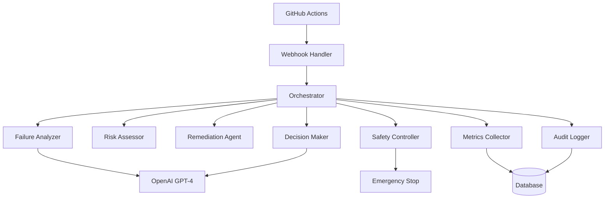

# Agentic CI - AI-Powered CI/CD Automation


**Agentic CI** is an intelligent CI/CD automation system that uses AI agents to analyze pipeline results, assess risks, and make automated merge decisions. Built for the Arbiter project, it provides comprehensive failure analysis, smart remediation, and safe auto-merge capabilities.

## 🌟 Key Features

### 🤖 AI-Powered Analysis
- **Intelligent Failure Analysis**: GPT-4 powered analysis of test failures, build errors, and quality gate violations
- **Risk Assessment**: Multi-factor risk scoring for automated merge decisions
- **Smart Remediation**: Automated attempts to fix common CI/CD issues

### 🛡️ Safety First
- **Emergency Stop Mechanism**: Instant system-wide halt for critical issues
- **Circuit Breaker Pattern**: Prevents cascading failures
- **Rate Limiting**: Protects against runaway automation
- **Multi-layered Approval**: Configurable approval requirements

### 📊 Comprehensive Monitoring
- **Real-time Metrics**: Performance tracking and decision accuracy
- **Audit Trail**: Complete log of all decisions and actions
- **Compliance Reporting**: Automated governance reports
- **Alert System**: Proactive notification of issues

### 🔄 Seamless Integration
- **GitHub Actions**: Native integration with existing workflows
- **Webhook Support**: Real-time event processing
- **Quality Gates**: Integration with performance and security gates
- **Chaos Engineering**: Compatibility with chaos testing

## 🚀 Quick Start

### Prerequisites
- Node.js 18+ or Bun 1.0+
- GitHub repository with Actions enabled
- OpenAI API key
- Docker (for containerized deployment)

### Installation

1. **Clone and Install**
   ```bash
   cd packages/agentic-ci
   bun install
   ```

2. **Configuration**
   ```bash
   # Copy environment template
   cp .env.example .env
   
   # Edit with your values
   nano .env
   ```

3. **Initialize Configuration**
   ```bash
   bun run cli config init
   ```

4. **Start the System**
   ```bash
   # Development
   bun run dev
   
   # Production
   bun run start
   ```

### Docker Deployment

```bash
# Using Docker Compose (recommended)
docker-compose up -d

# Or build and run manually
docker build -t agentic-ci .
docker run -d --name agentic-ci \
  -p 3000:3000 \
  --env-file .env \
  agentic-ci
```

## 🏗️ Architecture

### Core Components



### Agent Workflow

1. **Event Reception**: GitHub webhook triggers pipeline analysis
2. **Failure Analysis**: AI examines logs and identifies root causes
3. **Risk Assessment**: Multi-factor scoring of merge safety
4. **Remediation**: Automated fix attempts for common issues
5. **Decision Making**: AI-powered merge/block/escalate decision
6. **Safety Validation**: Final safety checks before execution
7. **Action Execution**: Auto-merge or human escalation
8. **Monitoring**: Continuous tracking and learning

## 🔧 Configuration

### Core Settings

```json
{
  "github": {
    "token": "ghp_...",
    "webhookSecret": "...",
    "repository": {
      "owner": "your-org",
      "repo": "your-repo"
    }
  },
  "openai": {
    "apiKey": "sk-...",
    "model": "gpt-4",
    "maxTokens": 8192,
    "temperature": 0.3
  },
  "autoMerge": {
    "enabled": true,
    "maxRiskScore": 30,
    "requireApproval": true,
    "minimumApprovals": 1
  }
}
```

### Risk Factors Configuration

```json
{
  "riskFactors": {
    "weights": {
      "changeSize": 0.3,
      "testCoverage": 0.25,
      "authorExperience": 0.15,
      "fileTypes": 0.15,
      "timeOfDay": 0.1,
      "deploymentFrequency": 0.05
    },
    "thresholds": {
      "largeChange": 500,
      "manyFiles": 20,
      "lowTestCoverage": 80,
      "criticalFiles": ["auth", "security", "payment"]
    }
  }
}
```

## 📖 CLI Usage

### System Management

```bash
# Start the system
bun run cli start --config ./config.json --port 3000

# Check status
bun run cli status --json

# Stop the system
bun run cli stop
```

### Configuration Management

```bash
# Initialize configuration
bun run cli config init --force

# Validate configuration
bun run cli config validate --config ./config.json

# Show configuration (sensitive values masked)
bun run cli config show --section autoMerge
```

### Emergency Controls

```bash
# Trigger emergency stop
bun run cli emergency stop --reason "Critical security issue"

# Reset emergency state
bun run cli emergency reset
```

### Metrics and Reporting

```bash
# Show current metrics
bun run cli metrics show --json

# Generate comprehensive report
bun run cli metrics report --output report.html --format html

# Export audit logs
bun run cli audit export --start 2024-01-01 --end 2024-01-31 --output logs.json
```

## 📊 GitHub Actions Integration

### Workflow Configuration

Add this to your `.github/workflows/` directory:

```yaml
name: Agentic CI Integration

on:
  workflow_run:
    workflows: ["Your Existing CI"]
    types: [completed]
  pull_request:
    types: [opened, synchronize]

jobs:
  agentic-analysis:
    runs-on: ubuntu-latest
    steps:
      - uses: actions/checkout@v4
      - name: Analyze with Agentic CI
        env:
          GITHUB_TOKEN: ${{ secrets.GITHUB_TOKEN }}
          OPENAI_API_KEY: ${{ secrets.OPENAI_API_KEY }}
        run: |
          # Agentic CI analysis runs here
```

### Required Secrets

Set these in your GitHub repository settings:

- `OPENAI_API_KEY`: Your OpenAI API key
- `AGENTIC_WEBHOOK_SECRET`: Webhook verification secret

### Optional Variables

- `AUTO_MERGE_ENABLED`: Enable/disable auto-merge (default: true)
- `AUTO_MERGE_MAX_RISK_SCORE`: Maximum risk score for auto-merge (default: 30)

## 🔍 Monitoring & Observability

### Metrics Dashboard

Access real-time metrics at:
- **Grafana**: `http://localhost:3001` (with monitoring profile)
- **Prometheus**: `http://localhost:9090` (with monitoring profile)
- **CLI**: `bun run cli metrics show`

### Key Metrics

- **Decision Accuracy**: Percentage of correct AI decisions
- **Response Time**: Average AI analysis time
- **Auto-merge Rate**: Successful automatic merges
- **False Positive Rate**: Incorrect block decisions
- **System Uptime**: Service availability

### Alert Conditions

- High failure rate (>10%)
- Slow response times (>5s)
- Security incidents
- Emergency stops
- API rate limits

## 🛡️ Security & Compliance

### Security Features

- **Input Validation**: All inputs validated with Zod schemas
- **Rate Limiting**: Protection against abuse
- **Audit Logging**: Complete action trail
- **Encrypted Storage**: Sensitive data encryption
- **Least Privilege**: Minimal required permissions

### Compliance

- **SOX Compliance**: Audit trail for financial systems
- **GDPR Compliance**: Privacy protection for EU users
- **HIPAA Compliance**: Healthcare data protection
- **Custom Compliance**: Configurable reporting

### Risk Mitigation

- **Multi-layered Approval**: Human oversight requirements
- **Emergency Stops**: Instant system shutdown
- **Rollback Capability**: Automated failure recovery
- **Circuit Breakers**: Prevents cascading failures

## 🔧 Development

### Project Structure

```
packages/agentic-ci/
├── src/
│   ├── agents/           # AI agents (failure analyzer, risk assessor, etc.)
│   ├── core/             # Core orchestration logic
│   ├── integration/      # GitHub and external integrations
│   ├── monitoring/       # Metrics and health monitoring
│   ├── safety/           # Safety controls and emergency stops
│   ├── governance/       # Audit logging and compliance
│   ├── config/           # Configuration management
│   └── cli/              # Command-line interface
├── tests/                # Test suites
├── docs/                 # Documentation
└── deployment/           # Deployment configurations
```

### Building

```bash
# Install dependencies
bun install

# Build TypeScript
bun run build

# Run tests
bun run test

# Run linting
bun run lint

# Type checking
bun run typecheck
```

### Testing

```bash
# Run all tests
bun run test

# Run specific test suite
bun run test:unit
bun run test:integration
bun run test:e2e

# Coverage report
bun run test:coverage
```

## 🤝 Integration Examples

### Custom Webhook Handler

```typescript
import { createAgenticCI } from '@arbiter/agentic-ci';
import { ConfigManager } from '@arbiter/agentic-ci/config';

const config = ConfigManager.getInstance().getConfig();
const agenticCI = await createAgenticCI(config);

// Start the system
await agenticCI.start();

// Custom event handling
agenticCI.orchestrator.on('decision_made', (decision) => {
  console.log('Decision made:', decision);
});
```

### Custom Risk Factors

```typescript
import { RiskAssessor } from '@arbiter/agentic-ci/agents';

const riskAssessor = new RiskAssessor(githubToken, config);

// Add custom risk factor
riskAssessor.addCustomFactor('deployment-time', (context) => {
  const hour = new Date().getHours();
  return hour >= 17 || hour <= 9 ? 0.2 : 0; // Higher risk outside business hours
});
```

### Custom Quality Gates

```typescript
import { Orchestrator } from '@arbiter/agentic-ci/core';

const orchestrator = new Orchestrator(config, auditLogger, metrics, safety);

// Add custom quality gate
orchestrator.addQualityGate('custom-security', async (context) => {
  // Custom security validation logic
  return {
    type: 'custom-security',
    status: 'passed',
    threshold: 'no-high-severity',
    actualValue: 'clean',
    details: { scanResults: '...' }
  };
});
```

## 🐛 Troubleshooting

### Common Issues

**Q: Agentic CI not receiving webhooks**
A: Check webhook URL, secret, and network connectivity. Verify GitHub webhook configuration.

**Q: OpenAI API errors**
A: Verify API key, check rate limits, ensure sufficient credits.

**Q: Auto-merge not working**
A: Check risk score thresholds, approval requirements, and PR status.

**Q: High memory usage**
A: Review log retention settings, check for memory leaks, optimize AI model parameters.

### Debug Mode

```bash
# Enable debug logging
LOG_LEVEL=debug bun run start

# Verbose CLI output
bun run cli status --debug

# Test configuration
bun run cli config validate --verbose
```

### Health Checks

```bash
# System health
curl http://localhost:3000/health

# Metrics endpoint
curl http://localhost:3000/metrics

# Status via CLI
bun run cli status
```

## 📚 API Reference

### Webhook Endpoints

- `POST /webhook` - GitHub webhook receiver
- `GET /health` - Health check endpoint
- `GET /metrics` - Prometheus metrics
- `GET /status` - System status

### Agent Methods

```typescript
// Failure Analyzer
await failureAnalyzer.analyzeFailures(failures, context);

// Risk Assessor
await riskAssessor.assessRisk(pipelineStatus);

// Decision Maker
await decisionMaker.makeDecision(pipelineStatus);

// Safety Controller
await safetyController.validateAutoMerge(pipelineStatus);
```

## 📄 License

This project is licensed under the MIT License - see the [LICENSE](../../LICENSE) file for details.

## 🤝 Contributing

1. Fork the repository
2. Create a feature branch (`git checkout -b feature/amazing-feature`)
3. Commit your changes (`git commit -m 'Add amazing feature'`)
4. Push to the branch (`git push origin feature/amazing-feature`)
5. Open a Pull Request

## 📞 Support

- **Documentation**: [Full documentation](./docs/)
- **Issues**: [GitHub Issues](https://github.com/your-org/arbiter/issues)
- **Discussions**: [GitHub Discussions](https://github.com/your-org/arbiter/discussions)

## 🙏 Acknowledgments

- OpenAI for GPT-4 API
- GitHub for Actions and API
- The Arbiter development team
- Open source community

---

Made with ❤️ by the Arbiter Team | Powered by AI 🤖