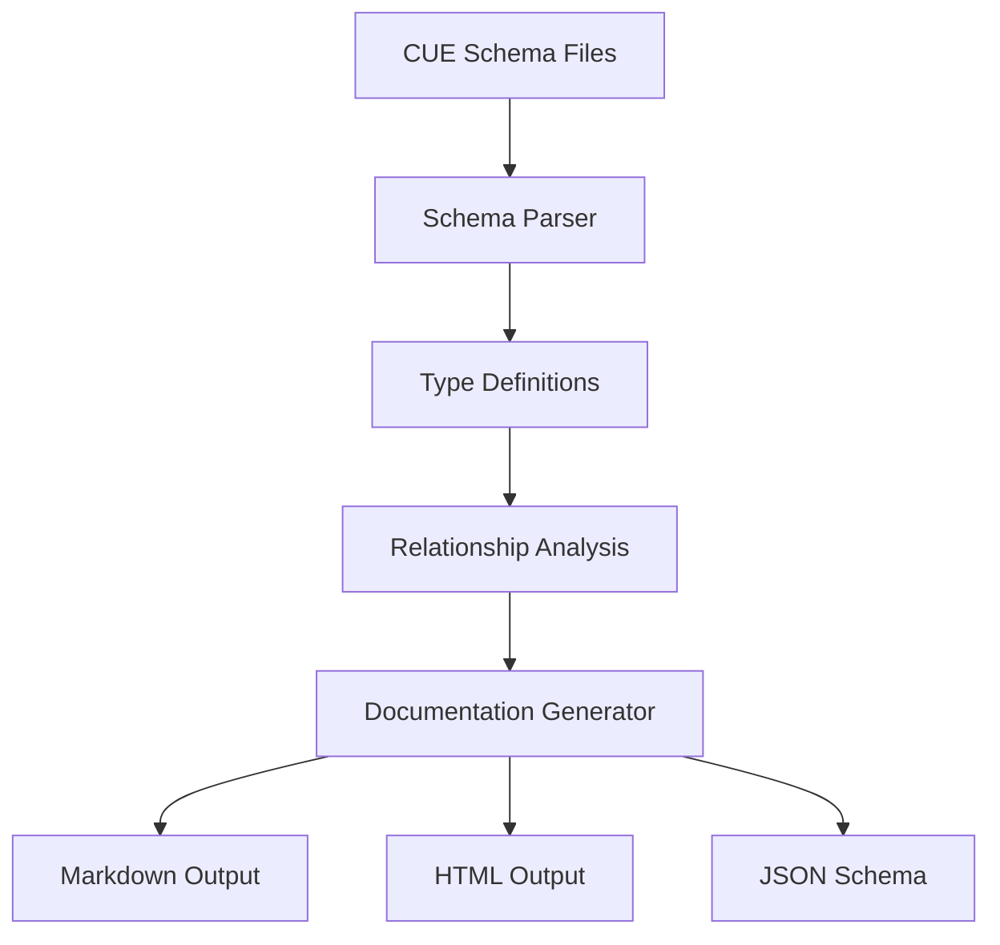

# CUE Schema Documentation System

A comprehensive documentation generation system for CUE schema files, designed specifically for the Arbiter project. This system parses CUE files, extracts type definitions, constraints, and relationships, then generates beautiful, navigable documentation in multiple formats.

## Features

- **🔍 Advanced CUE Parsing**: Supports complex CUE constructs including constraints, unions, structs, and references
- **📖 Multiple Output Formats**: Generate Markdown, HTML, and JSON Schema documentation
- **🔗 Relationship Mapping**: Automatically discovers and visualizes type dependencies and usage
- **🎨 Beautiful Templates**: Professional templates with syntax highlighting and responsive design
- **⚡ CLI Integration**: Easy-to-use CLI command integrated with the Arbiter toolchain
- **🔧 Extensible**: Customizable templates and parsing options

## Quick Start

### Using the CLI Command

Generate documentation for the Arbiter schemas:

```bash
# Generate basic documentation
bun cli schema-docs

# Generate with custom options
bun cli schema-docs \
  --input spec/schema \
  --output docs/generated \
  --format markdown,html,json \
  --title "Arbiter Schema Documentation" \
  --enhanced \
  --verbose
```

### Programmatic Usage

```typescript
import { EnhancedCUEParser, DocumentationGenerator } from './docs/index.js';

// Parse schema files
const parser = new EnhancedCUEParser();
const schema = await parser.parseSchemaDirectory('spec/schema');

// Generate documentation
const generator = new DocumentationGenerator({
  outputDir: 'docs/generated',
  formats: ['markdown', 'html'],
  title: 'My Schema Documentation'
});

await generator.generate(schema);
```

## Architecture

### Core Components

1. **Enhanced CUE Parser** (`enhanced-cue-parser.ts`)
   - Advanced parsing for complex CUE constructs
   - Multi-file parsing with cross-reference resolution
   - Nested structure handling and import resolution

2. **Documentation Generator** (`documentation-generator.ts`)
   - Multi-format output generation
   - Template-based rendering system
   - Relationship visualization with Mermaid diagrams

4. **Templates** (`templates/`)
   - Professional styling for HTML output
   - Technical documentation template
   - Customizable template system

### Data Flow



## Supported CUE Constructs

### Type Definitions

```cue
// Basic constraint types
#Email: =~"^[^@\\s]+@[^@\\s]+\\.[^@\\s]+$"
#Slug: =~"^[a-z0-9]+(?:[._-][a-z0-9]+)*$"

// Numeric constraints
#Percent: number & >=0.0 & <=1.0
#Port: int & >=1 & <=65535

// String constraints
#NonEmpty: string & !=""
```

### Enum Types

```cue
// Simple enums
#Status: "active" | "inactive" | "pending"

// Complex enums with constraints
#LogLevel: "debug" | "info" | "warn" | "error" | "fatal"
```

### Struct Types

```cue
// Basic structs
#User: {
  id: #Slug
  email: #Email
  status: #Status
}

// Optional fields and defaults
#Config: {
  timeout?: int | *5000
  retries?: int | *3
  debug?: bool | *false
}
```

### Complex Constraints

```cue
// Array constraints
#Tags: [...#Slug] & minItems(1) & maxItems(10)

// Object constraints
#Metadata: { [string]: string } & minFields(1)

// Reference types
#UserProfile: {
  user: #User
  settings: #Config
}
```

### Import Handling

```cue
package schema

import "strings"
import alias "external/package"

// The parser tracks imports and resolves references
```

## Output Formats

### Markdown Documentation

- **Table of Contents**: Automatically generated navigation
- **Type Definitions**: Detailed type information with constraints
- **Relationship Diagrams**: Mermaid diagrams showing type dependencies
- **Examples**: Usage examples extracted from comments
- **Cross-References**: Linked type references

### HTML Documentation

- **Responsive Design**: Mobile-friendly with collapsible navigation
- **Syntax Highlighting**: Code blocks with proper CUE highlighting
- **Interactive Navigation**: Clickable type relationships
- **Professional Styling**: Clean, technical documentation style
- **Search Functionality**: Browser-based search and filtering

### JSON Schema Output

- **Standards Compliant**: Valid JSON Schema Draft 7
- **Type Mapping**: CUE types mapped to JSON Schema equivalents
- **Constraint Preservation**: CUE constraints converted to JSON Schema rules
- **Documentation**: Descriptions and examples preserved

## Configuration Options

### CLI Options

| Option | Description | Default |
|--------|-------------|---------|
| `--input` | Input directory with CUE files | `spec/schema` |
| `--output` | Output directory | `docs/schema` |
| `--format` | Output formats (comma-separated) | `markdown,html` |
| `--title` | Documentation title | `Schema Documentation` |
| `--enhanced` | Use enhanced parser | `false` |
| `--include-private` | Include private types (_prefix) | `false` |
| `--no-examples` | Exclude examples | Include examples |
| `--no-relationships` | Exclude relationships | Include relationships |
| `--verbose` | Verbose output | `false` |

### Programmatic Options

```typescript
interface GeneratorOptions {
  outputDir: string;
  formats: ('markdown' | 'html' | 'json')[];
  title?: string;
  includePrivateTypes?: boolean;
  includeExamples?: boolean;
  includeRelationships?: boolean;
  customTemplates?: Partial<Templates>;
}
```

## Custom Templates

You can create custom templates for specialized documentation needs:

```typescript
import { Templates } from './documentation-generator.js';

const myCustomTemplate: Partial<Templates> = {
  markdownHeader: (title: string) => `# ${title}\n\nCustom documentation header\n\n`,
  
  markdownType: (type: ParsedType, schema: ParsedSchema) => {
    // Custom type rendering logic
    return `## ${type.name}\n\n${type.description}\n\n`;
  },
  
  htmlType: (type: ParsedType, schema: ParsedSchema) => {
    // Custom HTML rendering
    return `<div class="custom-type">${type.name}</div>`;
  }
};

const generator = new DocumentationGenerator({
  outputDir: 'docs',
  formats: ['markdown'],
  customTemplates: myCustomTemplate
});
```

## Examples

### Arbiter Schema Types

The Arbiter project defines several key schema types:

#### Core Types (`core_types.cue`)

- **`#Slug`**: URL-safe identifiers with specific patterns
- **`#Email`**: Valid email address format
- **`#URLPath`**: HTTP URL path format
- **`#HTTPMethod`**: Standard HTTP methods
- **`#HTTPStatus`**: Valid HTTP status codes

#### Application Specification (`app_spec.cue`)

- **`#AppSpec`**: Complete application specification
- **`#Flow`**: User interaction flows
- **`#CapabilitySpec`**: Feature capability definitions
- **`#HttpOperation`**: OpenAPI-style HTTP operations

#### Feature Specifications (`feature_spec.cue`)

- **`#FeatureSpec`**: Individual feature definitions
- **`#CompletionProfile`**: Feature completion requirements

### Example Generated Documentation

Here's what the generated documentation looks like for a typical type:

#### `#HTTPMethod`

**Category:** `constraint` | **Source:** `core_types.cue:11` | **Usage:** 5 references

##### Description

Standard HTTP methods supported by the API endpoints.

##### Technical Specification

| Property | Value |
|----------|-------|
| Base Type | `string` |
| Category | `constraint` |
| Pattern | `"GET" \| "POST" \| "PUT" \| "PATCH" \| "DELETE"` |

##### Allowed Values

```cue
"GET" | "POST" | "PUT" | "PATCH" | "DELETE"
```

##### Used By

- [`HttpOperation`](#httpoperation)
- [`ExpectAPI`](#expectapi)

## Best Practices

### Writing Documentable CUE

1. **Add Comments**: Use `//` comments above type definitions
2. **Include Examples**: Use `e.g.,` in comments to provide examples
3. **Use Descriptive Names**: Choose clear, unambiguous type names
4. **Organize by Domain**: Group related types in the same file
5. **Document Constraints**: Explain the purpose of constraints

```cue
// User identifier following slug pattern conventions
// Must be lowercase alphanumeric with hyphens/dots/underscores
// e.g., user-123, admin.user, system_account
#UserSlug: =~"^[a-z0-9]+(?:[._-][a-z0-9]+)*$"
```

### File Organization

```
spec/schema/
├── core_types.cue      # Basic primitive types
├── app_spec.cue        # Application specification
├── feature_spec.cue    # Feature definitions
└── completion_rules.cue # Validation rules
```

## Troubleshooting

### Common Issues

1. **No CUE files found**
   - Check the input directory path
   - Ensure files have `.cue` extension
   - Verify file permissions

2. **Parse errors**
   - Check CUE syntax with `cue fmt`
   - Ensure proper import statements
   - Validate type references

3. **Missing relationships**
   - Use `--enhanced` flag for better parsing
   - Check cross-file references
   - Ensure proper type names

### Debug Mode

Use `--verbose` flag to see detailed parsing information:

```bash
bun cli schema-docs --verbose
```

This will show:
- Input/output paths
- Number of types parsed
- Import resolution
- Type relationship building

## Contributing

### Adding New Parsers

To add support for new CUE constructs:

1. Extend the `ParsedType` interface
2. Add parsing logic to `parseComplexType()`
3. Update template rendering
4. Add test cases

### Adding New Templates

1. Create new template in `templates/`
2. Implement the `Templates` interface
3. Add template selection logic
4. Document usage examples

### Testing

Run the example generation to test parsing:

```bash
bun run packages/cli/src/docs/generate-example.ts
```

## License

Part of the Arbiter project. See the main project license for details.
